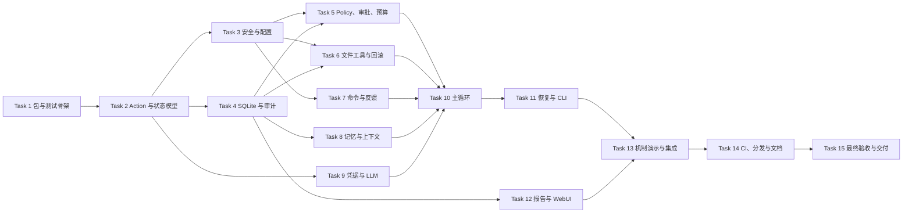

# Coding Agent Harness Jie 实施计划

> **For agentic workers / 供执行智能体使用：** REQUIRED SUB-SKILL：逐任务实现时必须使用 `superpowers:subagent-driven-development`（推荐）或 `superpowers:executing-plans`。每个任务使用复选框跟踪；必须严格执行 TDD 红-绿-重构，并在两阶段评审后填写 commit hash。

**Goal / 目标：** 在 Python 3.13 上实现一个可安装、可离线确定性测试的 Coding Agent Harness，使所有 LLM 动作在副作用前经过中央治理，并通过 CLI 与静态只读报告完整演示决策、工具、记忆、治理、反馈和配置六个维度。

**Architecture / 架构：** 自研同步 Agent Loop 只接受严格 Pydantic Action，通过不可绕过的 Policy Gateway 得到 `ALLOW / REQUIRE_APPROVAL / DENY`，再由 Dispatcher 调用工作区文件工具或白名单子进程。SQLite 保存权威状态，仓库外备份支持回滚，追加式 JSONL 提供审计；OpenAI-compatible 与 Scripted Mock LLM 共享同一低层协议，WebUI 只读取脱敏导出 JSON。

**Tech Stack / 技术栈：** Python 3.13、Pydantic v2、Typer、httpx、keyring、sqlite3、pytest、ruff、mypy、原生 HTML/CSS/JavaScript、GitHub Actions/Pages。

---

## 0. 执行规则与范围门禁

1. 本计划保存在课程指定的根目录 `PLAN.md`，覆盖 Superpowers 默认的 `docs/superpowers/plans/` 路径。
2. 任何正式实现前，先用不同类型的新鲜智能体按“冷启动协议”尝试 Task 1 和 Task 2 中的 1-2 个任务；实验 worktree 不直接并入正式分支。
3. 每个正式任务使用独立分支/worktree；一个 fresh subagent 只负责一个任务。
4. 每个任务依次执行：失败测试 -> 确认红灯 -> 最小实现 -> 确认绿灯 -> spec 合规评审 -> 代码质量评审 -> 提交。
5. 评审发现 Critical issue 时不得进入下一任务。人工修改必须在 `AGENT_LOG.md` 和 commit/PR 描述中如实记录。
6. 未经负责人批准，不安装依赖、不执行计划任务、不创建 worktree、不推送远端。
7. 所有测试默认离线运行，不读取真实 Keyring，不访问真实 LLM，不运行不可信第三方仓库代码。
8. 每完成一个任务，将本文件对应状态改为“完成”，补充 commit hash，并实时追加 `AGENT_LOG.md`。

## 1. 时间盒与优先级

| 时间 | 必须完成 | 降级原则 |
|---|---|---|
| 8 月 12 日上午 | PLAN 审阅、冷启动说明、准备陌生智能体实验 | 不开始正式实现 |
| 8 月 12 日中午前 | Task 1-5：骨架、协议、安全、持久化、治理 | 不做真实 API/UI 美化 |
| 8 月 12 日下午/晚 | Task 6-10：工具、反馈、记忆、LLM、主循环 | 先跑通 mock 闭环 |
| 8 月 13 日上午 | Task 11-13：恢复/CLI、报告、机制演示 | 只读 WebUI 保持最小静态实现 |
| 8 月 13 日下午 | Task 14-15：CI、打包、README、最终验证与 ZIP | 可选 ruff/mypy 项目扩展后置，但核心 pytest 不得后置 |

P0 为交付阻塞项：Task 1-11、Task 13、Task 15。Task 8、9、12、14 也必须完成最低实现，但在时间不足时只做 SPEC 定义的最小表面，不增加额外功能。

## 2. 依赖波次与并行关系



- Task 3 与 Task 4 可在 Task 2 合并后并行。
- Task 6、Task 7、Task 8、Task 9 可在各自依赖满足后并行，但不得共享 worktree。
- Task 12 可在 Task 4 的报告查询接口稳定后与 Task 10/11 并行。
- Task 10、Task 11、Task 13、Task 15 位于关键路径，不并行修改同一核心文件。

## 3. 目标文件结构

```text
Coding_Agent_Harness_Jie/
  pyproject.toml
  README.md
  Makefile
  .gitignore
  .gitattributes
  .gitlab-ci.yml
  .github/workflows/ci.yml
  .github/workflows/pages.yml
  src/coding_agent_harness/
    __init__.py
    cli.py
    models.py
    security.py
    config.py
    storage.py
    audit.py
    policy.py
    approvals.py
    journal.py
    file_tools.py
    command_runner.py
    validation.py
    memory.py
    context.py
    credentials.py
    llm.py
    application.py
    dispatcher.py
    engine.py
    reporting.py
    demo.py
    web/
      index.html
      styles.css
      app.js
      mock-report.json
  tests/
    conftest.py
    test_models.py
    test_security.py
    test_config.py
    test_storage.py
    test_policy.py
    test_approvals.py
    test_journal.py
    test_file_tools.py
    test_command_runner.py
    test_validation.py
    test_memory.py
    test_context.py
    test_credentials.py
    test_llm.py
    test_engine.py
    test_recovery.py
    test_cli.py
    test_reporting.py
    test_demo.py
    test_integration.py
  scripts/
    verify.ps1
    verify.sh
```

职责边界：`models.py` 只定义跨模块契约；`policy.py` 只判定；`dispatcher.py` 只验证授权并路由；文件、命令、验证、记忆、凭据互不直接调用 LLM；`engine.py` 是唯一组合主循环；`cli.py` 只负责输入输出与调用应用服务。

## 4. 稳定接口清单

后续任务必须保持以下名称一致：

```python
Action = ListFilesAction | ReadFileAction | ReplaceInFileAction | CreateFileAction | DeleteFileAction | RunCommandAction | ProposeMemoryAction | FinishAction
Decision = Literal["ALLOW", "REQUIRE_APPROVAL", "DENY"]
SessionStatus = Literal["CREATED", "RUNNING", "SUCCEEDED", "PAUSED_APPROVAL", "PAUSED_LIMIT_REACHED", "PAUSED_PROTOCOL_ERROR", "PAUSED_WORKSPACE_DRIFT", "PAUSED_INTERNAL_ERROR", "NEEDS_USER_DECISION", "CHANGES_KEPT", "ROLLED_BACK"]
LLMClient.next_action(context: ModelContext) -> Action
PolicyEngine.evaluate(action: Action, policy_context: PolicyContext) -> PolicyDecision
Dispatcher.execute(grant: AuthorizationGrant) -> Observation
ValidationPipeline.run(stage: ValidationStage, workspace: Path) -> list[ValidationResult]
HarnessEngine.run(session_id: str) -> SessionResult
```

任何签名变化必须先同步修改测试、本文稳定接口清单和 `AGENT_LOG.md`，不得在后续任务中悄悄改名。

### 4.1 测试 fixture 的渐进归属

`tests/conftest.py` 只能在对应生产类型已存在后增加 fixture，避免 pytest 收集阶段导入未来模块：

| Task | 新增 fixture | 精确构造方式 |
|---|---|---|
| 1 | `app_data`、`workspace` | 两个不同的 pytest 临时目录，保证应用数据不位于目标仓库中 |
| 4 | `store` | `StateStore(app_data / "state.db")`，测试前 `initialize()`，测试后 `close()` |
| 5 | `pending_action`、`changed_action` | 同一 session/action ID；后者只改变 Action 参数以测试 fingerprint 失效 |
| 6 | `journal`、`tools` | `ChangeJournal(store, app_data / "backups")` 与 `FileTools(workspace, journal)`；workspace 预置 existing/delete 文件 |
| 7 | `fake_runner`、`file_tools` spy、`dispatcher` | fake runner 使用 FIFO CommandResult；spy 只计数；dispatcher 注入真实 store 和假底层工具 |
| 9 | `model_context`、`credential_backend` | 最小合法 `ModelContext` 与新的 `MemoryCredentialBackend`，每个测试独立 |
| 10 | `engine_fixture`、`app_factory` | 组合真实临时 SQLite/Policy/Context 与可控 fake dispatcher/validator/clock；`dependencies()` 返回 Engine 构造参数 |
| 12 | `seed_report_session` 测试 helper | 只通过 StateStore 公开记录 API 写敏感样本，用于证明 exporter 采用字段 allowlist |

fixture 不得读取真实用户目录、真实 Keyring、环境中的 API Key 或网络；需要时间判断时注入 UTC clock，不能使用长时间 sleep。

## 5. 任务跟踪表

| Task | 内容 | 优先级 | 依赖 | 初始状态 | commit |
|---|---|---|---|---|---|
| 1 | 包、CLI 和测试骨架 | P0 | 无 | 未执行 | - |
| 2 | 严格 Action、Observation、状态模型 | P0 | 1 | 未执行 | - |
| 3 | 路径安全、脱敏与分层配置 | P0 | 2 | 未执行 | - |
| 4 | SQLite 权威状态与追加式审计 | P0 | 2 | 未执行 | - |
| 5 | Policy Gateway、审批、预算 | P0 | 3,4 | 未执行 | - |
| 6 | 文件工具、变更日志与回滚 | P0 | 3,4 | 未执行 | - |
| 7 | 白名单子进程与验证反馈 | P0 | 3,4 | 未执行 | - |
| 8 | 受治理记忆与有界上下文 | P0 | 4 | 未执行 | - |
| 9 | Keyring 凭据与 LLM 适配器 | P1 | 2 | 未执行 | - |
| 10 | 自研 Agent 主循环 | P0 | 5-9 | 未执行 | - |
| 11 | 持久恢复、漂移处理与 CLI | P0 | 10 | 未执行 | - |
| 12 | 脱敏报告与静态只读 WebUI | P1 | 4 | 未执行 | - |
| 13 | mock 集成测试与治理机制演示 | P0 | 11,12 | 未执行 | - |
| 14 | CI、打包、Pages 与 README | P1 | 13 | 未执行 | - |
| 15 | 全量验收、凭据扫描与交付 ZIP | P0 | 14 | 未执行 | - |

## 6. 陌生智能体冷启动协议

- 使用 Claude Code 新会话和一次性 worktree，不导入当前 Codex 对话、memory 或口头解释。
- 只提供已批准的 `SPEC.md` 与本 `PLAN.md`。
- 指令固定为：“从 Task 1 和 Task 2 中选择 1-2 个任务按计划尝试；遇到未写明决定立即暂停提问，不得猜测。”
- 记录：首次阻塞位置、全部问题、误解、失败测试、实现差异、耗时和输出 commit。
- 实验结束后不直接 merge；先区分 SPEC 缺陷、PLAN 缺陷、智能体阅读错误，再把修订前后 diff 写入 `SPEC_PROCESS.md`。
- 所有修订由负责人批准后，才能打开正式实现门禁；冷启动实验不勾选正式任务状态。

---

### Task 1：建立可安装包、CLI 与测试骨架

**目标：** 建立 Python 3.13 `src` 布局和可执行 `cah` 命令，不实现 Harness 行为。

**依赖：** 无。冷启动首选任务。

**Files:**
- Create: `pyproject.toml`
- Create: `src/coding_agent_harness/__init__.py`
- Create: `src/coding_agent_harness/cli.py`
- Create: `tests/conftest.py`
- Create: `tests/test_package.py`

- [ ] **Step 1：写入失败的包导入和 CLI 测试**

```python
# tests/test_package.py
from typer.testing import CliRunner

from coding_agent_harness import __version__
from coding_agent_harness.cli import app


def test_package_exposes_version() -> None:
    assert __version__ == "0.1.0"


def test_cli_help_lists_primary_commands() -> None:
    result = CliRunner().invoke(app, ["--help"])
    assert result.exit_code == 0
    for command in ("run", "sessions", "approvals", "changes", "credentials", "memory", "report", "demo"):
        assert command in result.stdout
```

- [ ] **Step 2：运行测试并确认红灯**

Run: `python -m pytest tests/test_package.py -v`

Expected: FAIL，错误包含 `ModuleNotFoundError: No module named 'coding_agent_harness'`。

- [ ] **Step 3：写入最小包元数据**

```toml
# pyproject.toml
[build-system]
requires = ["hatchling>=1.27"]
build-backend = "hatchling.build"

[project]
name = "coding-agent-harness-jie"
version = "0.1.0"
description = "A governed Python-first coding agent harness"
readme = "README.md"
requires-python = ">=3.13"
dependencies = [
  "httpx>=0.28,<1",
  "keyring>=25,<26",
  "pydantic>=2.11,<3",
  "typer>=0.16,<1",
]

[project.optional-dependencies]
dev = [
  "build>=1.2,<2",
  "mypy>=1.17,<2",
  "pytest>=8.4,<9",
  "pytest-cov>=6.2,<7",
  "ruff>=0.12,<1",
]

[project.scripts]
cah = "coding_agent_harness.cli:app"

[tool.hatch.build.targets.wheel]
packages = ["src/coding_agent_harness"]

[tool.pytest.ini_options]
testpaths = ["tests"]
addopts = "-ra"

[tool.ruff]
target-version = "py313"
line-length = 100

[tool.mypy]
python_version = "3.13"
strict = true
packages = ["coding_agent_harness"]
```

在负责人批准依赖安装后运行：`python -m pip install -e ".[dev]"`。

- [ ] **Step 4：实现版本和命令组占位表面**

```python
# src/coding_agent_harness/__init__.py
__version__ = "0.1.0"
```

```python
# tests/conftest.py
from pathlib import Path

import pytest


@pytest.fixture
def app_data(tmp_path_factory: pytest.TempPathFactory) -> Path:
    return tmp_path_factory.mktemp("cah-app-data")


@pytest.fixture
def workspace(tmp_path: Path) -> Path:
    root = tmp_path / "workspace"
    root.mkdir()
    return root
```

```python
# src/coding_agent_harness/cli.py
import typer

app = typer.Typer(no_args_is_help=True)
sessions = typer.Typer(no_args_is_help=True)
approvals = typer.Typer(no_args_is_help=True)
changes = typer.Typer(no_args_is_help=True)
credentials = typer.Typer(no_args_is_help=True)
memory = typer.Typer(no_args_is_help=True)
report = typer.Typer(no_args_is_help=True)
demo = typer.Typer(no_args_is_help=True)

for name, group in (
    ("sessions", sessions), ("approvals", approvals), ("changes", changes),
    ("credentials", credentials), ("memory", memory), ("report", report), ("demo", demo),
):
    app.add_typer(group, name=name)


@app.command()
def run() -> None:
    """Start a governed coding session."""
```

- [ ] **Step 5：运行单测和静态检查并确认绿灯**

Run: `python -m pytest tests/test_package.py -v`

Expected: `2 passed`。

Run: `python -m ruff check src tests/test_package.py`

Expected: exit code 0。

- [ ] **Step 6：两阶段评审并提交**

Spec review: 只建立入口和依赖，没有实现或绕过治理。

Quality review: `src` 布局正确，没有网络调用、Key 或生成缓存进入 Git。

```powershell
git add pyproject.toml src/coding_agent_harness/__init__.py src/coding_agent_harness/cli.py tests/conftest.py tests/test_package.py
git commit -m "build: scaffold Python package [agent: task-01-worker]" -m "人工修改：无"
```

---

### Task 2：定义严格 Action、Observation 与会话状态

**目标：** 建立所有模块共享的冻结数据契约，未知工具、额外字段和非法状态全部 fail-closed。

**依赖：** Task 1。冷启动第二候选任务。

**Files:**
- Create: `src/coding_agent_harness/models.py`
- Create: `tests/test_models.py`

- [ ] **Step 1：写入 Action 解析红灯测试**

```python
# tests/test_models.py
import pytest
from pydantic import ValidationError

from coding_agent_harness.models import ReplaceInFileAction, parse_action


def test_parse_exact_replace_action() -> None:
    action = parse_action({
        "tool": "replace_in_file",
        "path": "src/calc.py",
        "old_text": "return 1",
        "new_text": "return 2",
        "expected_matches": 1,
    })
    assert action == ReplaceInFileAction(
        path="src/calc.py", old_text="return 1", new_text="return 2", expected_matches=1
    )


@pytest.mark.parametrize("payload", [
    {"tool": "unknown"},
    {"tool": "read_file", "path": "x.py", "surprise": True},
    {"tool": "replace_in_file", "path": "x.py", "old_text": "a", "new_text": "b", "expected_matches": 0},
])
def test_invalid_actions_fail_closed(payload: dict[str, object]) -> None:
    with pytest.raises(ValidationError):
        parse_action(payload)
```

- [ ] **Step 2：运行测试并确认红灯**

Run: `python -m pytest tests/test_models.py -v`

Expected: FAIL，导入 `coding_agent_harness.models` 失败。

- [ ] **Step 3：实现严格联合类型与解析器**

```python
# src/coding_agent_harness/models.py
from enum import StrEnum
from typing import Annotated, Literal

from pydantic import BaseModel, ConfigDict, Field, TypeAdapter


class StrictModel(BaseModel):
    model_config = ConfigDict(extra="forbid", frozen=True)


class ListFilesAction(StrictModel):
    tool: Literal["list_files"] = "list_files"
    path: str = "."
    glob: str = "**/*"
    limit: int = Field(default=100, ge=1, le=500)


class ReadFileAction(StrictModel):
    tool: Literal["read_file"] = "read_file"
    path: str
    start_line: int = Field(default=1, ge=1)
    end_line: int = Field(default=200, ge=1)


class ReplaceInFileAction(StrictModel):
    tool: Literal["replace_in_file"] = "replace_in_file"
    path: str
    old_text: str = Field(min_length=1)
    new_text: str
    expected_matches: int = Field(default=1, ge=1, le=20)


class CreateFileAction(StrictModel):
    tool: Literal["create_file"] = "create_file"
    path: str
    content: str


class DeleteFileAction(StrictModel):
    tool: Literal["delete_file"] = "delete_file"
    path: str


class RunCommandAction(StrictModel):
    tool: Literal["run_command"] = "run_command"
    program: str
    args: tuple[str, ...] = ()
    cwd: str = "."
    timeout_seconds: int = Field(default=120, ge=1, le=300)


class ProposeMemoryAction(StrictModel):
    tool: Literal["propose_memory"] = "propose_memory"
    memory_type: Literal["project_convention", "validation_command", "confirmed_decision", "successful_fix"]
    content: str = Field(min_length=1, max_length=2_000)
    evidence_action_id: str | None = None
    tags: tuple[str, ...] = ()


class FinishAction(StrictModel):
    tool: Literal["finish"] = "finish"
    summary: str = Field(min_length=1, max_length=2_000)


Action = Annotated[
    ListFilesAction | ReadFileAction | ReplaceInFileAction | CreateFileAction |
    DeleteFileAction | RunCommandAction | ProposeMemoryAction | FinishAction,
    Field(discriminator="tool"),
]
ACTION_ADAPTER = TypeAdapter(Action)


def parse_action(payload: object) -> Action:
    return ACTION_ADAPTER.validate_python(payload)
```

- [ ] **Step 4：补齐决策、状态、Observation 与 ValidationResult 红灯测试**

```python
from coding_agent_harness.models import Observation, SessionStatus, validate_transition


def test_success_requires_running_source_state() -> None:
    assert validate_transition(SessionStatus.RUNNING, SessionStatus.SUCCEEDED) is True
    assert validate_transition(SessionStatus.CREATED, SessionStatus.SUCCEEDED) is False


def test_observation_is_bounded() -> None:
    with pytest.raises(ValidationError):
        Observation(category="tool_error", summary="x" * 4_001)
```

- [ ] **Step 5：实现枚举、结果模型和显式状态转换表**

```python
class Decision(StrEnum):
    ALLOW = "ALLOW"
    REQUIRE_APPROVAL = "REQUIRE_APPROVAL"
    DENY = "DENY"


class SessionStatus(StrEnum):
    CREATED = "CREATED"
    RUNNING = "RUNNING"
    SUCCEEDED = "SUCCEEDED"
    PAUSED_APPROVAL = "PAUSED_APPROVAL"
    PAUSED_LIMIT_REACHED = "PAUSED_LIMIT_REACHED"
    PAUSED_PROTOCOL_ERROR = "PAUSED_PROTOCOL_ERROR"
    PAUSED_WORKSPACE_DRIFT = "PAUSED_WORKSPACE_DRIFT"
    PAUSED_INTERNAL_ERROR = "PAUSED_INTERNAL_ERROR"
    NEEDS_USER_DECISION = "NEEDS_USER_DECISION"
    CHANGES_KEPT = "CHANGES_KEPT"
    ROLLED_BACK = "ROLLED_BACK"


class Observation(StrictModel):
    action_id: str | None = None
    category: Literal["test_failure", "lint_failure", "type_failure", "timeout", "tool_error", "policy_blocked", "approval_denied", "success"]
    summary: str = Field(max_length=4_000)
    evidence: str = Field(default="", max_length=50_000)


class ValidationResult(StrictModel):
    validator_id: str
    stage: Literal["baseline", "fast", "final"]
    status: Literal["passed", "failed", "error", "timeout"]
    exit_code: int | None
    duration_ms: int = Field(ge=0)
    summary: str = Field(max_length=4_000)
    evidence: str = Field(default="", max_length=50_000)


ALLOWED_TRANSITIONS: frozenset[tuple[SessionStatus, SessionStatus]] = frozenset({
    (SessionStatus.CREATED, SessionStatus.RUNNING),
    (SessionStatus.RUNNING, SessionStatus.SUCCEEDED),
    (SessionStatus.RUNNING, SessionStatus.PAUSED_APPROVAL),
    (SessionStatus.RUNNING, SessionStatus.PAUSED_LIMIT_REACHED),
    (SessionStatus.RUNNING, SessionStatus.PAUSED_PROTOCOL_ERROR),
    (SessionStatus.RUNNING, SessionStatus.PAUSED_WORKSPACE_DRIFT),
    (SessionStatus.RUNNING, SessionStatus.PAUSED_INTERNAL_ERROR),
    (SessionStatus.PAUSED_APPROVAL, SessionStatus.RUNNING),
    (SessionStatus.PAUSED_LIMIT_REACHED, SessionStatus.RUNNING),
    (SessionStatus.RUNNING, SessionStatus.NEEDS_USER_DECISION),
    (SessionStatus.NEEDS_USER_DECISION, SessionStatus.CHANGES_KEPT),
    (SessionStatus.NEEDS_USER_DECISION, SessionStatus.ROLLED_BACK),
})


def validate_transition(source: SessionStatus, target: SessionStatus) -> bool:
    return (source, target) in ALLOWED_TRANSITIONS
```

- [ ] **Step 6：运行模型测试并提交**

Run: `python -m pytest tests/test_models.py -v`

Expected: 全部 PASS。

Run: `python -m mypy src/coding_agent_harness/models.py`

Expected: exit code 0。

```powershell
git add src/coding_agent_harness/models.py tests/test_models.py
git commit -m "feat(core): add strict action and state models [agent: task-02-worker]" -m "人工修改：无"
```

---

### Task 3：实现路径安全、脱敏与分层配置

**目标：** 为所有路径、日志和配置建立统一安全底线；项目和 CLI 层只能收紧权限。

**依赖：** Task 2。可与 Task 4 并行。

**Files:**
- Create: `src/coding_agent_harness/security.py`
- Create: `src/coding_agent_harness/config.py`
- Create: `tests/test_security.py`
- Create: `tests/test_config.py`

- [ ] **Step 1：写路径围栏和敏感文件红灯测试**

```python
# tests/test_security.py
from pathlib import Path

import pytest

from coding_agent_harness.security import SecurityViolation, WorkspaceGuard, redact_text


def test_workspace_guard_accepts_normal_relative_path(tmp_path: Path) -> None:
    target = tmp_path / "src" / "app.py"
    target.parent.mkdir()
    target.write_text("value = 1\n", encoding="utf-8")
    guard = WorkspaceGuard(tmp_path)
    assert guard.resolve("src/app.py", must_exist=True) == target.resolve()


@pytest.mark.parametrize("path", ["../secret.txt", ".env", ".env.local", ".git/config", "id_rsa", "cert.pem"])
def test_workspace_guard_rejects_escape_and_sensitive_paths(tmp_path: Path, path: str) -> None:
    with pytest.raises(SecurityViolation):
        WorkspaceGuard(tmp_path).resolve(path)


def test_redaction_removes_key_and_absolute_workspace(tmp_path: Path) -> None:
    text = f"Authorization: Bearer sk-secret at {tmp_path / 'src/app.py'}"
    redacted = redact_text(text, workspace=tmp_path, secrets=("sk-secret",))
    assert "sk-secret" not in redacted
    assert str(tmp_path) not in redacted
    assert "<WORKSPACE>" in redacted
```

- [ ] **Step 2：运行安全测试并确认红灯**

Run: `python -m pytest tests/test_security.py -v`

Expected: FAIL，导入 `coding_agent_harness.security` 失败。

- [ ] **Step 3：实现规范化路径、安全模式和递归脱敏**

```python
# src/coding_agent_harness/security.py
import fnmatch
import hashlib
import json
import os
import re
from pathlib import Path, PurePath
from typing import Any

from coding_agent_harness.models import Action, parse_action

SENSITIVE_PATTERNS = (".env", ".env.*", ".git", ".git/*", ".ssh", ".ssh/*", "*.pem", "*.key", "id_rsa", "id_ed25519")


class SecurityViolation(ValueError):
    pass


class WorkspaceGuard:
    def __init__(self, root: Path) -> None:
        self.root = root.resolve(strict=True)
        if not self.root.is_dir():
            raise SecurityViolation("workspace_not_directory")

    def resolve(self, raw: str, *, must_exist: bool = False) -> Path:
        candidate_path = Path(raw)
        if candidate_path.is_absolute() or ".." in PurePath(raw).parts:
            raise SecurityViolation("path_escape")
        relative = candidate_path.as_posix()
        if relative.startswith("./"):
            relative = relative[2:]
        relative = relative or "."
        if any(fnmatch.fnmatch(relative, pattern) for pattern in SENSITIVE_PATTERNS):
            raise SecurityViolation("sensitive_path")
        unresolved = self.root / candidate_path
        anchor = unresolved if unresolved.exists() else unresolved.parent
        resolved_anchor = anchor.resolve(strict=True)
        if not resolved_anchor.is_relative_to(self.root):
            raise SecurityViolation("link_escape")
        resolved = unresolved.resolve(strict=must_exist)
        if not resolved.is_relative_to(self.root):
            raise SecurityViolation("path_escape")
        return resolved

    def relative(self, path: Path) -> str:
        return path.resolve().relative_to(self.root).as_posix()


def normalize_action(action: Action, guard: WorkspaceGuard) -> Action:
    payload = action.model_dump(mode="json")
    if hasattr(action, "path"):
        must_exist = action.tool in {"list_files", "read_file", "replace_in_file", "delete_file"}
        payload["path"] = guard.relative(guard.resolve(action.path, must_exist=must_exist))
    if action.tool == "run_command":
        payload["program"] = action.program.casefold()
        payload["cwd"] = guard.relative(guard.resolve(action.cwd, must_exist=True))
        payload["args"] = list(action.args)
    return parse_action(payload)


def action_fingerprint(action: Action) -> str:
    payload = json.dumps(action.model_dump(mode="json"), sort_keys=True, separators=(",", ":"), ensure_ascii=True)
    return hashlib.sha256(payload.encode("utf-8")).hexdigest()


def redact_text(text: str, *, workspace: Path | None = None, secrets: tuple[str, ...] = ()) -> str:
    value = text
    for secret in sorted((item for item in secrets if item), key=len, reverse=True):
        value = value.replace(secret, "<REDACTED>")
    value = re.sub(r"(?i)(authorization:\s*bearer\s+)[^\s]+", r"\1<REDACTED>", value)
    value = re.sub(r"(?i)(api[_-]?key\s*[=:]\s*)[^\s,;]+", r"\1<REDACTED>", value)
    if workspace is not None:
        value = value.replace(str(workspace.resolve()), "<WORKSPACE>")
    return value


def scrub_environment(environment: dict[str, str]) -> dict[str, str]:
    blocked = ("KEY", "TOKEN", "SECRET", "PASSWORD", "CREDENTIAL")
    return {key: value for key, value in environment.items() if not any(word in key.upper() for word in blocked)}
```

- [ ] **Step 4：写配置优先级和权限扩张红灯测试**

```python
# tests/test_config.py
from pathlib import Path

import pytest
from pydantic import ValidationError

from coding_agent_harness.config import BudgetConfig, ConfigError, load_project_config, tighten_budgets


def test_lower_trust_budget_can_only_tighten() -> None:
    trusted = BudgetConfig(max_steps=20, max_llm_calls=12, command_timeout_seconds=120)
    project = BudgetConfig(max_steps=30, max_llm_calls=8, command_timeout_seconds=200)
    resolved = tighten_budgets(trusted, project)
    assert resolved.max_steps == 20
    assert resolved.max_llm_calls == 8
    assert resolved.command_timeout_seconds == 120


def test_project_config_rejects_unknown_and_permission_fields(tmp_path: Path) -> None:
    path = tmp_path / "harness.toml"
    path.write_text("allow_shell = true\n", encoding="utf-8")
    with pytest.raises((ConfigError, ValidationError)):
        load_project_config(path)
```

- [ ] **Step 5：实现严格配置模型和只收紧合并**

```python
# src/coding_agent_harness/config.py
import tomllib
from pathlib import Path

from pydantic import Field

from coding_agent_harness.models import StrictModel


class ConfigError(ValueError):
    pass


class BudgetConfig(StrictModel):
    max_steps: int = Field(default=20, ge=1, le=40)
    max_llm_calls: int = Field(default=12, ge=1, le=24)
    max_consecutive_failures: int = Field(default=4, ge=1, le=8)
    max_repeated_action: int = Field(default=2, ge=1, le=3)
    command_timeout_seconds: int = Field(default=120, ge=1, le=300)
    session_timeout_minutes: int = Field(default=30, ge=1, le=60)
    max_observation_bytes: int = Field(default=50_000, ge=1_000, le=100_000)


class ValidatorConfig(StrictModel):
    validator_id: str
    program: str = "python"
    args: tuple[str, ...]
    stages: tuple[str, ...] = ("baseline", "fast", "final")
    required: bool = True


class UserConfig(StrictModel):
    provider_url: str = "https://api.openai.com/v1"
    model: str = "gpt-5-mini"
    credential_profile: str = "default"
    budgets: BudgetConfig = BudgetConfig()


class ProjectConfig(StrictModel):
    source_roots: tuple[str, ...] = ("src", "tests")
    validators: tuple[ValidatorConfig, ...] = (
        ValidatorConfig(validator_id="pytest", args=("-m", "pytest")),
    )
    budgets: BudgetConfig = BudgetConfig()


def tighten_budgets(trusted: BudgetConfig, lower_trust: BudgetConfig) -> BudgetConfig:
    return BudgetConfig(**{
        field: min(getattr(trusted, field), getattr(lower_trust, field))
        for field in BudgetConfig.model_fields
    })


def load_project_config(path: Path) -> ProjectConfig:
    try:
        return ProjectConfig.model_validate(tomllib.loads(path.read_text(encoding="utf-8")))
    except (OSError, tomllib.TOMLDecodeError) as exc:
        raise ConfigError(str(exc)) from exc
```

实现 `resolve_config(user, project, cli)` 时按 user -> project -> CLI 连续调用 `tighten_budgets`；项目验证器仍需在 Task 5/7 经过命令策略，不能通过配置注册 shell 或网络命令。

- [ ] **Step 6：运行安全与配置测试并提交**

Run: `python -m pytest tests/test_security.py tests/test_config.py -v`

Expected: 全部 PASS。

Run: `python -m ruff check src/coding_agent_harness/security.py src/coding_agent_harness/config.py tests/test_security.py tests/test_config.py`

Expected: exit code 0。

```powershell
git add src/coding_agent_harness/security.py src/coding_agent_harness/config.py tests/test_security.py tests/test_config.py
git commit -m "feat(security): enforce paths redaction and config trust [agent: task-03-worker]" -m "人工修改：无"
```

---

### Task 4：实现 SQLite 权威状态与追加式审计

**目标：** 持久化项目、会话、动作、策略、审批、反馈、验证、记忆和变更元数据，并用 JSONL 保存脱敏事件。

**依赖：** Task 2。可与 Task 3 并行。

**Files:**
- Create: `src/coding_agent_harness/storage.py`
- Create: `src/coding_agent_harness/audit.py`
- Modify: `tests/conftest.py`
- Create: `tests/test_storage.py`

- [ ] **Step 1：写事务、重启恢复和非法转换红灯测试**

```python
# tests/test_storage.py
from pathlib import Path

import pytest

from coding_agent_harness.models import SessionStatus
from coding_agent_harness.storage import StateStore, StorageError


def test_session_survives_store_restart(tmp_path: Path) -> None:
    db = tmp_path / "state.db"
    first = StateStore(db)
    first.initialize()
    project_id = first.upsert_project(tmp_path / "repo", display_name="repo")
    session_id = first.create_session(project_id=project_id, task="fix tests")
    first.transition_session(session_id, SessionStatus.RUNNING)
    first.close()
    second = StateStore(db)
    second.initialize()
    assert second.get_session(session_id).status is SessionStatus.RUNNING


def test_illegal_transition_rolls_back(tmp_path: Path) -> None:
    store = StateStore(tmp_path / "state.db")
    store.initialize()
    project_id = store.upsert_project(tmp_path / "repo", display_name="repo")
    session_id = store.create_session(project_id=project_id, task="fix tests")
    with pytest.raises(StorageError, match="illegal_session_transition"):
        store.transition_session(session_id, SessionStatus.SUCCEEDED)
    assert store.get_session(session_id).status is SessionStatus.CREATED
```

- [ ] **Step 2：运行存储测试并确认红灯**

Run: `python -m pytest tests/test_storage.py -v`

Expected: FAIL，导入 `coding_agent_harness.storage` 失败。

- [ ] **Step 3：建立数据库 schema 和事务 API**

`StateStore.initialize()` 必须在一个事务中建立下列表；所有 ID 使用 `uuid.uuid4().hex`，时间使用带 UTC 时区的 ISO 8601：

```sql
CREATE TABLE IF NOT EXISTS projects (
  id TEXT PRIMARY KEY, canonical_path TEXT NOT NULL UNIQUE, display_name TEXT NOT NULL
);
CREATE TABLE IF NOT EXISTS sessions (
  id TEXT PRIMARY KEY, project_id TEXT NOT NULL, task TEXT NOT NULL, status TEXT NOT NULL,
  budget_json TEXT NOT NULL, created_at TEXT NOT NULL, updated_at TEXT NOT NULL,
  FOREIGN KEY(project_id) REFERENCES projects(id)
);
CREATE UNIQUE INDEX IF NOT EXISTS one_active_writer
ON sessions(project_id) WHERE status IN (
  'CREATED','RUNNING','PAUSED_APPROVAL','PAUSED_LIMIT_REACHED','PAUSED_PROTOCOL_ERROR',
  'PAUSED_WORKSPACE_DRIFT','PAUSED_INTERNAL_ERROR','NEEDS_USER_DECISION'
);
CREATE TABLE IF NOT EXISTS actions (
  id TEXT PRIMARY KEY, session_id TEXT NOT NULL, step INTEGER NOT NULL, tool TEXT NOT NULL,
  normalized_json TEXT NOT NULL, fingerprint TEXT NOT NULL, created_at TEXT NOT NULL
);
CREATE TABLE IF NOT EXISTS policy_decisions (
  id TEXT PRIMARY KEY, action_id TEXT NOT NULL UNIQUE, decision TEXT NOT NULL,
  reason_code TEXT NOT NULL, rule_source TEXT NOT NULL, created_at TEXT NOT NULL
);
CREATE TABLE IF NOT EXISTS approvals (
  id TEXT PRIMARY KEY, action_id TEXT NOT NULL UNIQUE, session_id TEXT NOT NULL,
  fingerprint TEXT NOT NULL, nonce_digest TEXT NOT NULL, status TEXT NOT NULL,
  created_at TEXT NOT NULL, expires_at TEXT NOT NULL, decided_at TEXT, consumed_at TEXT
);
CREATE TABLE IF NOT EXISTS observations (
  id TEXT PRIMARY KEY, session_id TEXT NOT NULL, action_id TEXT, category TEXT NOT NULL,
  summary TEXT NOT NULL, evidence TEXT NOT NULL, created_at TEXT NOT NULL
);
CREATE TABLE IF NOT EXISTS validations (
  id TEXT PRIMARY KEY, session_id TEXT NOT NULL, validator_id TEXT NOT NULL, stage TEXT NOT NULL,
  status TEXT NOT NULL, exit_code INTEGER, duration_ms INTEGER NOT NULL,
  summary TEXT NOT NULL, evidence TEXT NOT NULL, created_at TEXT NOT NULL
);
CREATE TABLE IF NOT EXISTS memory_entries (
  id TEXT PRIMARY KEY, project_id TEXT NOT NULL, source_session_id TEXT NOT NULL,
  memory_type TEXT NOT NULL, content TEXT NOT NULL, evidence_action_id TEXT,
  tags_json TEXT NOT NULL, status TEXT NOT NULL, created_at TEXT NOT NULL, updated_at TEXT NOT NULL
);
CREATE TABLE IF NOT EXISTS changes (
  id TEXT PRIMARY KEY, session_id TEXT NOT NULL, relative_path TEXT NOT NULL,
  operation TEXT NOT NULL, before_digest TEXT, after_digest TEXT,
  backup_ref TEXT, sequence INTEGER NOT NULL, created_at TEXT NOT NULL
);
CREATE TABLE IF NOT EXISTS audit_outbox (
  sequence INTEGER PRIMARY KEY AUTOINCREMENT, event_json TEXT NOT NULL,
  created_at TEXT NOT NULL, flushed_at TEXT
);
```

`StateStore` 使用 `sqlite3.connect(self.path, isolation_level=None)`、`PRAGMA foreign_keys=ON`、`PRAGMA journal_mode=WAL`；写操作用 `BEGIN IMMEDIATE` context manager，失败必须 rollback。实现 `upsert_project`、`create/get/transition_session`、`record_action`、`record_policy_decision`、`record_observation`、`record_validation` 和后续模块需要的查询接口。

- [ ] **Step 4：写审计追加、脱敏和失败关闭红灯测试**

```python
from coding_agent_harness.audit import AuditWriter


def test_audit_writer_appends_redacted_jsonl(tmp_path: Path) -> None:
    path = tmp_path / "audit" / "events.jsonl"
    writer = AuditWriter(path, workspace=tmp_path, secrets=("sk-secret",))
    writer.append({"event": "policy", "detail": f"sk-secret {tmp_path}"})
    line = path.read_text(encoding="utf-8").splitlines()[0]
    assert "sk-secret" not in line
    assert str(tmp_path) not in line
    assert '"event":"policy"' in line
```

- [ ] **Step 5：实现 fsync 的只追加 AuditWriter 和 outbox 刷新**

```python
# src/coding_agent_harness/audit.py
import json
import os
from pathlib import Path
from typing import Any

from coding_agent_harness.security import redact_text


class AuditError(RuntimeError):
    pass


class AuditWriter:
    def __init__(self, path: Path, *, workspace: Path | None = None, secrets: tuple[str, ...] = ()) -> None:
        self.path = path
        self.workspace = workspace
        self.secrets = secrets

    def append(self, event: dict[str, Any]) -> None:
        self.path.parent.mkdir(parents=True, exist_ok=True)
        raw = json.dumps(event, ensure_ascii=False, sort_keys=True, separators=(",", ":"))
        line = redact_text(raw, workspace=self.workspace, secrets=self.secrets) + "\n"
        try:
            fd = os.open(self.path, os.O_APPEND | os.O_CREAT | os.O_WRONLY, 0o600)
            with os.fdopen(fd, "a", encoding="utf-8", newline="\n") as handle:
                handle.write(line)
                handle.flush()
                os.fsync(handle.fileno())
        except OSError as exc:
            raise AuditError("audit_append_failed") from exc
```

`StateStore.enqueue_audit(event)` 与业务记录放在同一 SQLite 事务；`flush_audit(writer)` 按 sequence 写 JSONL，成功后设置 `flushed_at`。策略 outbox 未成功 flush 时 Dispatcher 不得执行副作用。

- [ ] **Step 6：运行重启、事务和审计测试并提交**

Run: `python -m pytest tests/test_storage.py -v`

Expected: 全部 PASS。

Run: `python -m ruff check src/coding_agent_harness/storage.py src/coding_agent_harness/audit.py tests/test_storage.py`

Expected: exit code 0。

```powershell
git add src/coding_agent_harness/storage.py src/coding_agent_harness/audit.py tests/conftest.py tests/test_storage.py
git commit -m "feat(storage): persist state and append audit events [agent: task-04-worker]" -m "人工修改：无"
```

---

### Task 5：实现 Policy Gateway、持久化审批与预算

**目标：** 把三级风险、审批绑定、单次消费和全部默认/硬预算编码为确定性治理机制。

**依赖：** Task 3、Task 4。

**Files:**
- Create: `src/coding_agent_harness/policy.py`
- Create: `src/coding_agent_harness/approvals.py`
- Modify: `tests/conftest.py`
- Create: `tests/test_policy.py`
- Create: `tests/test_approvals.py`

- [ ] **Step 1：写完整风险矩阵红灯测试**

```python
# tests/test_policy.py
from pathlib import Path

import pytest

from coding_agent_harness.models import Decision, parse_action
from coding_agent_harness.policy import PolicyContext, PolicyEngine


@pytest.mark.parametrize(("payload", "expected"), [
    ({"tool": "read_file", "path": "src/a.py"}, Decision.ALLOW),
    ({"tool": "replace_in_file", "path": "src/a.py", "old_text": "a", "new_text": "b"}, Decision.ALLOW),
    ({"tool": "create_file", "path": "src/new.py", "content": "x"}, Decision.REQUIRE_APPROVAL),
    ({"tool": "delete_file", "path": "src/a.py"}, Decision.REQUIRE_APPROVAL),
    ({"tool": "replace_in_file", "path": "pyproject.toml", "old_text": "a", "new_text": "b"}, Decision.REQUIRE_APPROVAL),
    ({"tool": "run_command", "program": "python", "args": ["-m", "pytest"]}, Decision.ALLOW),
    ({"tool": "run_command", "program": "git", "args": ["push"]}, Decision.DENY),
    ({"tool": "run_command", "program": "powershell", "args": ["-Command", "dir"]}, Decision.DENY),
    ({"tool": "read_file", "path": ".env"}, Decision.DENY),
])
def test_builtin_risk_matrix(tmp_path: Path, payload: dict[str, object], expected: Decision) -> None:
    (tmp_path / "src").mkdir(exist_ok=True)
    (tmp_path / "src" / "a.py").write_text("a = 1\n", encoding="utf-8")
    (tmp_path / "pyproject.toml").write_text("[project]\n", encoding="utf-8")
    decision = PolicyEngine().evaluate(parse_action(payload), PolicyContext.for_workspace(tmp_path))
    assert decision.decision is expected
```

- [ ] **Step 2：运行策略测试并确认红灯**

Run: `python -m pytest tests/test_policy.py -v`

Expected: FAIL，导入 `coding_agent_harness.policy` 失败。

- [ ] **Step 3：实现原因码、命令白名单、受保护路径和授权票据**

```python
# src/coding_agent_harness/policy.py
from dataclasses import dataclass
from pathlib import Path

from coding_agent_harness.config import BudgetConfig
from coding_agent_harness.models import Action, Decision, RunCommandAction, StrictModel, parse_action
from coding_agent_harness.security import SecurityViolation, WorkspaceGuard, action_fingerprint, normalize_action

PROTECTED_PATHS = frozenset({"pyproject.toml", "harness.toml", ".gitlab-ci.yml", "Makefile"})
ALLOWED_COMMANDS = {
    ("python", "-m", "pytest"): Decision.ALLOW,
    ("python", "-m", "ruff"): Decision.ALLOW,
    ("python", "-m", "mypy"): Decision.ALLOW,
    ("python", "-m", "compileall"): Decision.ALLOW,
    ("git", "status"): Decision.ALLOW,
    ("git", "diff"): Decision.ALLOW,
    ("git", "add"): Decision.REQUIRE_APPROVAL,
    ("git", "commit"): Decision.REQUIRE_APPROVAL,
}


class PolicyDecision(StrictModel):
    decision: Decision
    reason_code: str
    rule_source: str
    fingerprint: str


@dataclass(frozen=True)
class PolicyContext:
    workspace: Path
    budgets: BudgetConfig

    @classmethod
    def for_workspace(cls, workspace: Path) -> "PolicyContext":
        return cls(workspace=workspace, budgets=BudgetConfig())


class AuthorizationGrant(StrictModel):
    action_id: str
    session_id: str
    action: Action
    fingerprint: str
    policy_decision_id: str
    approval_id: str | None = None


class PolicyEngine:
    def evaluate(self, action: Action, context: PolicyContext) -> PolicyDecision:
        try:
            if hasattr(action, "path"):
                WorkspaceGuard(context.workspace).resolve(action.path)
        except SecurityViolation as exc:
            return PolicyDecision(decision=Decision.DENY, reason_code=str(exc), rule_source="builtin", fingerprint=action_fingerprint(action))
        if action.tool in {"create_file", "delete_file"}:
            result, reason = Decision.REQUIRE_APPROVAL, "file_lifecycle_change"
        elif action.tool == "replace_in_file" and action.path in PROTECTED_PATHS:
            result, reason = Decision.REQUIRE_APPROVAL, "protected_file_change"
        elif isinstance(action, RunCommandAction):
            if action.program == "python" and action.args[:3] == ("-m", "pip", "install"):
                result = Decision.REQUIRE_APPROVAL if "--no-index" in action.args else Decision.DENY
                reason = "local_dependency_install" if result is Decision.REQUIRE_APPROVAL else "network_install_denied"
            else:
                key = (action.program, *action.args[:2])
                result = next((decision for prefix, decision in ALLOWED_COMMANDS.items() if key[:len(prefix)] == prefix), Decision.DENY)
                reason = "command_allowlist" if result is not Decision.DENY else "command_not_allowed"
        elif action.tool == "propose_memory":
            result, reason = Decision.ALLOW, "memory_candidate_only"
        else:
            result, reason = Decision.ALLOW, "low_risk_workspace_action"
        return PolicyDecision(decision=result, reason_code=reason, rule_source="builtin", fingerprint=action_fingerprint(action))
```

额外实现：拒绝不带 `--no-index` 的 pip、网络下载、shell 元字符和远程 Git；`.github/workflows/*`、锁文件和依赖清单均视为受保护路径。项目配置只能缩小 `ALLOWED_COMMANDS`，不得添加前缀。

`PolicyGateway` 是 Engine 唯一可调用的治理入口，负责“判定 -> 持久化 -> 审计 flush -> 生成 grant/待审批请求”。接口必须明确为：

```python
class PendingAction(StrictModel):
    action_id: str
    session_id: str
    action: Action
    fingerprint: str


class PolicyResolution(StrictModel):
    action_id: str
    action: Action
    fingerprint: str
    decision: Decision
    reason_code: str
    grant: AuthorizationGrant | None = None
    pending_action: PendingAction | None = None
    approval_ttl_seconds: int = 900


class PolicyGateway:
    def __init__(self, engine: PolicyEngine, store, audit_writer) -> None:
        self.engine = engine
        self.store = store
        self.audit_writer = audit_writer

    def authorize(self, session_id: str, step: int, action: Action, workspace: Path) -> PolicyResolution:
        guard = WorkspaceGuard(workspace)
        try:
            normalized = normalize_action(action, guard)
            fingerprint = action_fingerprint(normalized)
            decision = self.engine.evaluate(normalized, PolicyContext.for_workspace(workspace))
        except SecurityViolation as exc:
            safe_payload = action.model_dump(mode="json")
            if "path" in safe_payload:
                safe_payload["path"] = "<REJECTED_PATH>"
            if "cwd" in safe_payload:
                safe_payload["cwd"] = "<REJECTED_CWD>"
            normalized = parse_action(safe_payload)
            fingerprint = action_fingerprint(action)
            decision = PolicyDecision(decision=Decision.DENY, reason_code=str(exc), rule_source="builtin", fingerprint=fingerprint)
        action_id = self.store.record_action(session_id, step, normalized, fingerprint)
        decision_id = self.store.record_policy_decision(action_id, decision)
        self.store.enqueue_audit({"event": "policy_decision", "session_id": session_id, "action_id": action_id, "decision": decision.decision, "reason_code": decision.reason_code})
        self.store.flush_audit(self.audit_writer)
        if decision.decision is Decision.ALLOW:
            grant = AuthorizationGrant(action_id=action_id, session_id=session_id, action=normalized, fingerprint=fingerprint, policy_decision_id=decision_id)
            return PolicyResolution(action_id=action_id, action=normalized, fingerprint=fingerprint, decision=decision.decision, reason_code=decision.reason_code, grant=grant)
        pending = None
        if decision.decision is Decision.REQUIRE_APPROVAL:
            pending = PendingAction(action_id=action_id, session_id=session_id, action=normalized, fingerprint=fingerprint)
        return PolicyResolution(action_id=action_id, action=normalized, fingerprint=fingerprint, decision=decision.decision, reason_code=decision.reason_code, pending_action=pending)
```

若 `record_policy_decision`、`enqueue_audit` 或 `flush_audit` 任一失败，Gateway 抛出受控内部错误；Engine 将会话暂停，Dispatcher 调用次数必须保持 0。

- [ ] **Step 4：写审批过期、替换、重放与预算红灯测试**

```python
# tests/test_approvals.py
from datetime import UTC, datetime, timedelta

import pytest

from coding_agent_harness.approvals import ApprovalError, ApprovalService, BudgetTracker


def test_approved_action_is_consumed_once(store, pending_action) -> None:
    service = ApprovalService(store)
    approval = service.request(pending_action, expires_in=timedelta(minutes=10))
    service.approve(approval.id)
    grant = service.consume(approval.id, pending_action)
    assert grant.approval_id == approval.id
    with pytest.raises(ApprovalError, match="approval_not_approved"):
        service.consume(approval.id, pending_action)


def test_changed_fingerprint_invalidates_approval(store, pending_action, changed_action) -> None:
    service = ApprovalService(store)
    approval = service.request(pending_action, expires_in=timedelta(minutes=10))
    service.approve(approval.id)
    with pytest.raises(ApprovalError, match="approval_fingerprint_mismatch"):
        service.consume(approval.id, changed_action)


def test_budget_pauses_on_first_reached_limit() -> None:
    tracker = BudgetTracker(max_steps=2, max_llm_calls=12, max_consecutive_failures=4, max_repeated_action=2)
    tracker.record_step("fp-1")
    tracker.record_step("fp-2")
    assert tracker.stop_reason() == "max_steps"
```

- [ ] **Step 5：实现审批状态机、原子消费和预算计数器**

```python
# src/coding_agent_harness/approvals.py
import hashlib
import secrets
from dataclasses import dataclass, field
from datetime import UTC, datetime, timedelta

from coding_agent_harness.policy import AuthorizationGrant
from coding_agent_harness.security import action_fingerprint


class ApprovalError(RuntimeError):
    pass


class ApprovalService:
    def __init__(self, store) -> None:
        self.store = store

    def request(self, pending_action, *, expires_in: timedelta):
        nonce_digest = hashlib.sha256(secrets.token_bytes(32)).hexdigest()
        return self.store.create_approval(
            action_id=pending_action.action_id,
            session_id=pending_action.session_id,
            fingerprint=action_fingerprint(pending_action.action),
            nonce_digest=nonce_digest,
            expires_at=datetime.now(UTC) + expires_in,
        )

    def approve(self, approval_id: str):
        return self.store.transition_approval(approval_id, expected="PENDING", target="APPROVED")

    def deny(self, approval_id: str):
        return self.store.transition_approval(approval_id, expected="PENDING", target="DENIED")

    def consume(self, approval_id: str, pending_action) -> AuthorizationGrant:
        fingerprint = action_fingerprint(pending_action.action)
        return self.store.consume_approval_atomically(approval_id, pending_action, fingerprint)


@dataclass
class BudgetTracker:
    max_steps: int
    max_llm_calls: int
    max_consecutive_failures: int
    max_repeated_action: int
    steps: int = 0
    llm_calls: int = 0
    consecutive_failures: int = 0
    fingerprints: dict[str, int] = field(default_factory=dict)

    @classmethod
    def from_session(cls, session) -> "BudgetTracker":
        saved = session.budget
        return cls(
            max_steps=saved["max_steps"],
            max_llm_calls=saved["max_llm_calls"],
            max_consecutive_failures=saved["max_consecutive_failures"],
            max_repeated_action=saved["max_repeated_action"],
            steps=saved.get("steps", 0),
            llm_calls=saved.get("llm_calls", 0),
            consecutive_failures=saved.get("consecutive_failures", 0),
            fingerprints=dict(saved.get("fingerprints", {})),
        )

    def record_step(self, fingerprint: str) -> None:
        self.steps += 1
        self.fingerprints[fingerprint] = self.fingerprints.get(fingerprint, 0) + 1

    def record_validation(self, passed: bool) -> None:
        self.consecutive_failures = 0 if passed else self.consecutive_failures + 1

    def stop_reason(self) -> str | None:
        if self.steps >= self.max_steps:
            return "max_steps"
        if self.llm_calls >= self.max_llm_calls:
            return "max_llm_calls"
        if self.consecutive_failures >= self.max_consecutive_failures:
            return "max_consecutive_failures"
        if any(count >= self.max_repeated_action for count in self.fingerprints.values()):
            return "repeated_action"
        return None
```

`consume_approval_atomically` 必须同时检查：状态 `APPROVED`、session/action/fingerprint 完全匹配、未过期、工作区指纹未漂移；成功时在同一事务写 `CONSUMED` 和 `consumed_at`。任何失败均不返回 grant，并记录脱敏原因。

- [ ] **Step 6：运行完整治理测试并提交**

Run: `python -m pytest tests/test_policy.py tests/test_approvals.py -v`

Expected: 风险矩阵、审批生命周期、预算测试全部 PASS。

Run: `python -m mypy src/coding_agent_harness/policy.py src/coding_agent_harness/approvals.py`

Expected: exit code 0。

```powershell
git add src/coding_agent_harness/policy.py src/coding_agent_harness/approvals.py tests/conftest.py tests/test_policy.py tests/test_approvals.py
git commit -m "feat(governance): enforce policy approvals and budgets [agent: task-05-worker]" -m "人工修改：无"
```

---

### Task 6：实现文件工具、变更日志与精准回滚

**目标：** 提供有界读取和原子文件修改；任何副作用前先把元数据与原始字节持久化到仓库外。

**依赖：** Task 3、Task 4。可与 Task 7-9 并行。

**Files:**
- Create: `src/coding_agent_harness/journal.py`
- Create: `src/coding_agent_harness/file_tools.py`
- Modify: `tests/conftest.py`
- Create: `tests/test_journal.py`
- Create: `tests/test_file_tools.py`

- [ ] **Step 1：写精确替换和 fail-closed 红灯测试**

```python
# tests/test_file_tools.py
from pathlib import Path

import pytest

from coding_agent_harness.file_tools import FileToolError, FileTools
from coding_agent_harness.journal import ChangeJournal


def test_replace_requires_exact_match_count(tmp_path: Path, app_data: Path, store) -> None:
    target = tmp_path / "calc.py"
    target.write_text("value = 1\nvalue = 1\n", encoding="utf-8")
    tools = FileTools(tmp_path, ChangeJournal(store, app_data / "backups"))
    with pytest.raises(FileToolError, match="match_count_mismatch"):
        tools.replace("s1", "calc.py", "value = 1", "value = 2", expected_matches=1)
    assert target.read_text(encoding="utf-8") == "value = 1\nvalue = 1\n"


def test_replace_records_backup_before_write(tmp_path: Path, app_data: Path, store) -> None:
    target = tmp_path / "calc.py"
    target.write_bytes(b"value = 1\r\n")
    journal = ChangeJournal(store, app_data / "backups")
    FileTools(tmp_path, journal).replace("s1", "calc.py", "value = 1", "value = 2", 1)
    record = store.list_changes("s1")[0]
    assert Path(record.backup_ref).read_bytes() == b"value = 1\r\n"
    assert target.read_bytes() == b"value = 2\r\n"
```

- [ ] **Step 2：运行文件测试并确认红灯**

Run: `python -m pytest tests/test_file_tools.py -v`

Expected: FAIL，文件工具模块不存在。

- [ ] **Step 3：实现备份、原子写入和有界读取**

```python
# src/coding_agent_harness/journal.py
import hashlib
from pathlib import Path


def digest_bytes(content: bytes) -> str:
    return hashlib.sha256(content).hexdigest()


class ChangeJournal:
    def __init__(self, store, backup_root: Path) -> None:
        self.store = store
        self.backup_root = backup_root.resolve()

    def record_before_change(self, session_id: str, relative_path: str, target: Path, operation: str):
        before = target.read_bytes() if target.exists() else None
        backup_ref = None
        if before is not None:
            backup = self.backup_root / session_id / f"{len(self.store.list_changes(session_id)):06d}.bin"
            backup.parent.mkdir(parents=True, exist_ok=True)
            backup.write_bytes(before)
            backup_ref = str(backup)
        return self.store.create_change(
            session_id=session_id,
            relative_path=relative_path,
            operation=operation,
            before_digest=digest_bytes(before) if before is not None else None,
            backup_ref=backup_ref,
        )
```

```python
# src/coding_agent_harness/file_tools.py
import os
import tempfile
from pathlib import Path

from coding_agent_harness.journal import ChangeJournal, digest_bytes
from coding_agent_harness.security import WorkspaceGuard


class FileToolError(RuntimeError):
    pass


def _atomic_write(target: Path, content: bytes) -> None:
    fd, temp_name = tempfile.mkstemp(prefix=f".{target.name}.", dir=target.parent)
    try:
        with os.fdopen(fd, "wb") as handle:
            handle.write(content)
            handle.flush()
            os.fsync(handle.fileno())
        os.replace(temp_name, target)
    finally:
        if os.path.exists(temp_name):
            os.unlink(temp_name)


class FileTools:
    def __init__(self, workspace: Path, journal: ChangeJournal) -> None:
        self.guard = WorkspaceGuard(workspace)
        self.journal = journal

    def read(self, path: str, start_line: int, end_line: int) -> str:
        target = self.guard.resolve(path, must_exist=True)
        if target.stat().st_size > 1_000_000:
            raise FileToolError("file_too_large")
        lines = target.read_text(encoding="utf-8").splitlines()
        return "\n".join(f"{number}: {line}" for number, line in enumerate(lines[start_line - 1:end_line], start=start_line))

    def replace(self, session_id: str, path: str, old: str, new: str, expected_matches: int):
        target = self.guard.resolve(path, must_exist=True)
        raw = target.read_bytes()
        text = raw.decode("utf-8")
        if text.count(old) != expected_matches:
            raise FileToolError("match_count_mismatch")
        record = self.journal.record_before_change(session_id, self.guard.relative(target), target, "modify")
        updated = text.replace(old, new, expected_matches).encode("utf-8")
        _atomic_write(target, updated)
        self.journal.store.finish_change(record.id, after_digest=digest_bytes(updated))
        return record
```

同一模式实现 `list_files`（排序、上限和截断标记）、`create`（目标必须不存在）、`delete`（备份成功后删除）。任何 DB/备份/fsync 失败均不得触碰目标文件。

- [ ] **Step 4：写多操作回滚和漂移红灯测试**

```python
# tests/test_journal.py
def test_rollback_restores_only_session_changes(workspace, journal, tools) -> None:
    untouched = workspace / "untouched.py"
    untouched.write_text("keep\n", encoding="utf-8")
    tools.replace("s1", "existing.py", "before", "after", 1)
    tools.create("s1", "new.py", "new\n")
    tools.delete("s1", "delete.py")
    journal.rollback("s1", workspace)
    assert (workspace / "existing.py").read_text(encoding="utf-8") == "before\n"
    assert not (workspace / "new.py").exists()
    assert (workspace / "delete.py").read_text(encoding="utf-8") == "delete me\n"
    assert untouched.read_text(encoding="utf-8") == "keep\n"


def test_rollback_refuses_external_drift(workspace, journal, tools) -> None:
    tools.replace("s1", "existing.py", "before", "after", 1)
    (workspace / "existing.py").write_text("external\n", encoding="utf-8")
    with pytest.raises(FileToolError, match="workspace_drift"):
        journal.rollback("s1", workspace)
```

- [ ] **Step 5：实现逆序回滚和指纹复查**

`rollback(session_id, workspace)` 按 `sequence DESC`：先确认当前内容等于 `after_digest`；`modify/delete` 从 `backup_ref` 原子恢复，`create` 只在指纹匹配时删除；完成后写回滚审计与会话状态。`keep` 只改变状态，不删除备份，备份清理由显式维护命令后置。

- [ ] **Step 6：运行文件与回滚测试并提交**

Run: `python -m pytest tests/test_file_tools.py tests/test_journal.py -v`

Expected: 全部 PASS，且测试不调用 Git。

```powershell
git add src/coding_agent_harness/journal.py src/coding_agent_harness/file_tools.py tests/conftest.py tests/test_journal.py tests/test_file_tools.py
git commit -m "feat(tools): journal atomic file changes and rollback [agent: task-06-worker]" -m "人工修改：无"
```

---

### Task 7：实现白名单子进程、验证流水线与 Dispatcher

**目标：** 使用 `shell=False` 执行已治理命令，限制环境、时间和输出，并将验证结果标准化为 Observation。

**依赖：** Task 3、Task 4、Task 5、Task 6。

**Files:**
- Create: `src/coding_agent_harness/command_runner.py`
- Create: `src/coding_agent_harness/validation.py`
- Create: `src/coding_agent_harness/dispatcher.py`
- Modify: `tests/conftest.py`
- Create: `tests/test_command_runner.py`
- Create: `tests/test_validation.py`
- Create: `tests/test_dispatcher.py`

- [ ] **Step 1：写 shell、环境、超时和截断红灯测试**

```python
# tests/test_command_runner.py
import os
import sys
from pathlib import Path

from coding_agent_harness.command_runner import CommandRunner
from coding_agent_harness.models import RunCommandAction


def test_runner_scrubs_credentials_and_never_uses_shell(tmp_path: Path, monkeypatch) -> None:
    monkeypatch.setenv("OPENAI_API_KEY", "sk-secret")
    action = RunCommandAction(
        program="python",
        args=("-c", "import os; print(os.getenv('OPENAI_API_KEY', 'missing'))"),
        cwd=".",
    )
    result = CommandRunner(max_output_bytes=1_000).run(action, workspace=tmp_path)
    assert result.exit_code == 0
    assert result.stdout.strip() == "missing"
    assert "sk-secret" not in result.stdout


def test_runner_truncates_output(tmp_path: Path) -> None:
    action = RunCommandAction(program="python", args=("-c", "print('x' * 5000)"), cwd=".")
    result = CommandRunner(max_output_bytes=100).run(action, workspace=tmp_path)
    assert len(result.stdout.encode()) <= 120
    assert result.truncated is True
```

- [ ] **Step 2：运行命令测试并确认红灯**

Run: `python -m pytest tests/test_command_runner.py -v`

Expected: FAIL，命令运行器模块不存在。

- [ ] **Step 3：实现结构化 Popen、进程树超时和输出限制**

```python
# src/coding_agent_harness/command_runner.py
import os
import signal
import subprocess
import sys
import time
from pathlib import Path

from pydantic import BaseModel

from coding_agent_harness.models import RunCommandAction
from coding_agent_harness.security import WorkspaceGuard, redact_text, scrub_environment


class CommandResult(BaseModel):
    exit_code: int | None
    stdout: str
    stderr: str
    duration_ms: int
    timed_out: bool
    truncated: bool


class CommandRunner:
    def __init__(self, max_output_bytes: int = 50_000) -> None:
        self.max_output_bytes = max_output_bytes

    def run(self, action: RunCommandAction, *, workspace: Path) -> CommandResult:
        guard = WorkspaceGuard(workspace)
        cwd = guard.resolve(action.cwd, must_exist=True)
        executable = sys.executable if action.program == "python" else action.program
        flags = subprocess.CREATE_NEW_PROCESS_GROUP if os.name == "nt" else 0
        started = time.monotonic()
        process = subprocess.Popen(
            [executable, *action.args], cwd=cwd, env=scrub_environment(dict(os.environ)),
            stdout=subprocess.PIPE, stderr=subprocess.PIPE, text=True, shell=False,
            start_new_session=os.name != "nt", creationflags=flags,
        )
        timed_out = False
        try:
            stdout, stderr = process.communicate(timeout=action.timeout_seconds)
        except subprocess.TimeoutExpired:
            timed_out = True
            if os.name == "nt":
                subprocess.run(["taskkill", "/F", "/T", "/PID", str(process.pid)], check=False, capture_output=True, shell=False)
            else:
                os.killpg(process.pid, signal.SIGKILL)
            stdout, stderr = process.communicate()
        combined = (stdout + stderr).encode("utf-8", errors="replace")
        truncated = len(combined) > self.max_output_bytes
        if truncated:
            stdout = stdout.encode("utf-8")[:self.max_output_bytes].decode("utf-8", errors="replace") + "\n<TRUNCATED>"
            stderr = ""
        return CommandResult(
            exit_code=None if timed_out else process.returncode,
            stdout=redact_text(stdout, workspace=workspace), stderr=redact_text(stderr, workspace=workspace),
            duration_ms=int((time.monotonic() - started) * 1000), timed_out=timed_out, truncated=truncated,
        )
```

- [ ] **Step 4：写阶段验证和完成门禁红灯测试**

```python
# tests/test_validation.py
from coding_agent_harness.validation import ValidationPipeline, ValidationStage


def test_failed_final_validator_closes_success_gate(tmp_path, fake_runner) -> None:
    fake_runner.queue(exit_code=1, stderr="1 failed")
    pipeline = ValidationPipeline.default(fake_runner)
    results = pipeline.run(ValidationStage.FINAL, tmp_path)
    assert pipeline.success_gate_open(results) is False
    assert results[0].status == "failed"
    assert results[0].summary == "pytest failed"
```

- [ ] **Step 5：实现验证阶段和授权 Dispatcher**

```python
# src/coding_agent_harness/validation.py
from enum import StrEnum
from pathlib import Path

from coding_agent_harness.config import ValidatorConfig
from coding_agent_harness.models import RunCommandAction, ValidationResult


class ValidationStage(StrEnum):
    BASELINE = "baseline"
    FAST = "fast"
    FINAL = "final"


class ValidationPipeline:
    def __init__(self, runner, validators: tuple[ValidatorConfig, ...]) -> None:
        self.runner = runner
        self.validators = validators

    @classmethod
    def default(cls, runner):
        return cls(runner, (ValidatorConfig(validator_id="pytest", args=("-m", "pytest")),))

    def run(self, stage: ValidationStage, workspace: Path) -> list[ValidationResult]:
        results = []
        for spec in self.validators:
            if stage.value not in spec.stages:
                continue
            command = RunCommandAction(program=spec.program, args=spec.args, cwd=".")
            raw = self.runner.run(command, workspace=workspace)
            status = "timeout" if raw.timed_out else "passed" if raw.exit_code == 0 else "failed"
            results.append(ValidationResult(
                validator_id=spec.validator_id, stage=stage.value, status=status,
                exit_code=raw.exit_code, duration_ms=raw.duration_ms,
                summary=f"{spec.validator_id} {status}", evidence=(raw.stdout + raw.stderr)[:50_000],
            ))
        return results

    def success_gate_open(self, results: list[ValidationResult]) -> bool:
        return bool(results) and all(result.status == "passed" for result in results)


def observation_from_validation(action_id: str, results: list[ValidationResult]):
    failed = next((item for item in results if item.status != "passed"), None)
    if failed is None:
        return Observation(action_id=action_id, category="success", summary="fast validation passed")
    category = {"pytest": "test_failure", "ruff": "lint_failure", "mypy": "type_failure"}.get(
        failed.validator_id, "tool_error"
    )
    return Observation(action_id=action_id, category=category, summary=failed.summary, evidence=failed.evidence)
```

```python
# tests/test_dispatcher.py
import pytest

from coding_agent_harness.dispatcher import DispatchError
from coding_agent_harness.models import ReadFileAction


def test_dispatcher_rejects_raw_action_without_touching_tool(dispatcher, file_tools) -> None:
    with pytest.raises(DispatchError, match="authorization_grant_required"):
        dispatcher.execute(ReadFileAction(path="app.py"))
    assert file_tools.call_count == 0


def test_dispatcher_rejects_unconsumed_approval(dispatcher, approval_grant, file_tools) -> None:
    with pytest.raises(DispatchError, match="consumed_approval_required"):
        dispatcher.execute(approval_grant)
    assert file_tools.call_count == 0
```

```python
# src/coding_agent_harness/dispatcher.py
from coding_agent_harness.models import (
    CreateFileAction, DeleteFileAction, ListFilesAction, Observation, ProposeMemoryAction,
    ReadFileAction, ReplaceInFileAction, RunCommandAction,
)
from coding_agent_harness.policy import AuthorizationGrant
from coding_agent_harness.security import action_fingerprint


class DispatchError(RuntimeError):
    pass


class Dispatcher:
    def __init__(self, store, file_tools, command_runner, memory_service, workspace) -> None:
        self.store = store
        self.file_tools = file_tools
        self.command_runner = command_runner
        self.memory_service = memory_service
        self.workspace = workspace

    def execute(self, grant: AuthorizationGrant) -> Observation:
        if not isinstance(grant, AuthorizationGrant):
            raise DispatchError("authorization_grant_required")
        if action_fingerprint(grant.action) != grant.fingerprint:
            raise DispatchError("grant_fingerprint_mismatch")
        decision = self.store.get_policy_decision(grant.policy_decision_id)
        if decision.decision == "DENY":
            raise DispatchError("denied_action_cannot_dispatch")
        if decision.decision == "REQUIRE_APPROVAL" and not self.store.is_consumed_approval(grant.approval_id, grant.fingerprint):
            raise DispatchError("consumed_approval_required")

        action = grant.action
        if isinstance(action, ListFilesAction):
            value = self.file_tools.list(action.path, action.glob, action.limit)
        elif isinstance(action, ReadFileAction):
            value = self.file_tools.read(action.path, action.start_line, action.end_line)
        elif isinstance(action, ReplaceInFileAction):
            value = self.file_tools.replace(grant.session_id, action.path, action.old_text, action.new_text, action.expected_matches)
        elif isinstance(action, CreateFileAction):
            value = self.file_tools.create(grant.session_id, action.path, action.content)
        elif isinstance(action, DeleteFileAction):
            value = self.file_tools.delete(grant.session_id, action.path)
        elif isinstance(action, RunCommandAction):
            value = self.command_runner.run(action, workspace=self.workspace)
        elif isinstance(action, ProposeMemoryAction):
            value = self.memory_service.propose_from_action(grant.session_id, action)
        else:
            raise DispatchError("unsupported_dispatch_action")
        return Observation(action_id=grant.action_id, category="success", summary=f"{action.tool} completed", evidence=str(value)[:50_000])
```

补充测试：传裸 Action、篡改 fingerprint、DENY 决策或未消费审批时，Dispatcher 均抛出 `DispatchError` 且底层工具调用次数为 0。验证失败由 `ValidationPipeline` 生成 `test_failure`、`lint_failure` 或 `type_failure` Observation；绝不把 LLM 的完成摘要当作成功证据。

- [ ] **Step 6：运行命令、验证和 Dispatcher 测试并提交**

Run: `python -m pytest tests/test_command_runner.py tests/test_validation.py tests/test_dispatcher.py -v`

Expected: 全部 PASS；超时测试结束后不存在遗留子进程。

```powershell
git add src/coding_agent_harness/command_runner.py src/coding_agent_harness/validation.py src/coding_agent_harness/dispatcher.py tests/conftest.py tests/test_command_runner.py tests/test_validation.py tests/test_dispatcher.py
git commit -m "feat(feedback): run governed commands and validators [agent: task-07-worker]" -m "人工修改：无"
```

---

### Task 8：实现受治理记忆与有界上下文

**目标：** 只激活有验证或用户批准证据的结构化记忆，并按固定优先级构造有字节预算的模型上下文。

**依赖：** Task 4。可与 Task 6、7、9 并行。

**Files:**
- Create: `src/coding_agent_harness/memory.py`
- Create: `src/coding_agent_harness/context.py`
- Create: `tests/test_memory.py`
- Create: `tests/test_context.py`

- [ ] **Step 1：写候选生命周期和最多五条检索红灯测试**

```python
# tests/test_memory.py
from coding_agent_harness.memory import MemoryService


def test_unapproved_subjective_memory_is_not_retrievable(store) -> None:
    service = MemoryService(store)
    entry = service.propose("p1", "s1", "confirmed_decision", "Use UTC", None, ("time",))
    assert entry.status == "CANDIDATE"
    assert service.search("p1", keywords=("UTC",), limit=5) == []


def test_verified_successful_fix_activates_and_search_is_bounded(store) -> None:
    service = MemoryService(store)
    for index in range(7):
        service.propose_verified_fix("p1", "s1", f"fix cache {index}", f"a{index}", ("cache",))
    results = service.search("p1", keywords=("cache",), limit=5)
    assert len(results) == 5
    assert all(entry.status == "ACTIVE" for entry in results)
```

- [ ] **Step 2：运行记忆测试并确认红灯**

Run: `python -m pytest tests/test_memory.py -v`

Expected: FAIL，记忆服务模块不存在。

- [ ] **Step 3：实现候选、批准、验证激活、拒绝和删除**

```python
# src/coding_agent_harness/memory.py
ALLOWED_MEMORY_TYPES = frozenset({"project_convention", "validation_command", "confirmed_decision", "successful_fix"})


class MemoryError(RuntimeError):
    pass


class MemoryService:
    def __init__(self, store) -> None:
        self.store = store

    def propose(self, project_id, session_id, memory_type, content, evidence_action_id, tags):
        if memory_type not in ALLOWED_MEMORY_TYPES:
            raise MemoryError("memory_type_not_allowed")
        return self.store.create_memory(project_id, session_id, memory_type, content, evidence_action_id, tags, "CANDIDATE")

    def propose_verified_fix(self, project_id, session_id, content, evidence_action_id, tags):
        if not self.store.action_has_successful_validation(session_id, evidence_action_id):
            raise MemoryError("missing_validation_evidence")
        return self.store.create_memory(project_id, session_id, "successful_fix", content, evidence_action_id, tags, "ACTIVE")

    def approve(self, entry_id: str):
        return self.store.transition_memory(entry_id, {"CANDIDATE", "APPROVED"}, "ACTIVE")

    def reject(self, entry_id: str):
        return self.store.transition_memory(entry_id, {"CANDIDATE", "APPROVED"}, "REJECTED")

    def delete(self, entry_id: str):
        return self.store.transition_memory(entry_id, {"CANDIDATE", "APPROVED", "ACTIVE", "REJECTED"}, "DELETED")

    def search(self, project_id: str, *, keywords: tuple[str, ...], limit: int = 5):
        return self.store.search_active_memory(project_id, keywords, min(limit, 5))
```

- [ ] **Step 4：写上下文优先级和截断红灯测试**

```python
# tests/test_context.py
from coding_agent_harness.context import ContextBuilder


def test_context_keeps_task_policy_and_current_failure_under_pressure() -> None:
    context = ContextBuilder(max_bytes=1_200).build(
        task="fix failing test",
        completion_criteria="all required validators pass",
        policy_summary="never read .env",
        current_failure="test_total expected 4 got 3",
        source_snippets=("x" * 2_000,),
        observations=("old observation" * 200,),
        memories=("old memory" * 200,),
    )
    serialized = context.model_dump_json()
    assert "fix failing test" in serialized
    assert "never read .env" in serialized
    assert "expected 4 got 3" in serialized
    assert len(serialized.encode("utf-8")) <= 1_200
```

- [ ] **Step 5：实现 ModelContext 和确定性预算裁剪**

```python
# src/coding_agent_harness/context.py
from coding_agent_harness.models import StrictModel
from coding_agent_harness.security import redact_text


class ModelContext(StrictModel):
    task: str
    completion_criteria: str
    policy_summary: str
    tools: tuple[dict[str, object], ...] = ()
    validator_summary: str = ""
    current_failure: str = ""
    source_snippets: tuple[str, ...] = ()
    recent_observations: tuple[str, ...] = ()
    memories: tuple[str, ...] = ()


class ContextBuilder:
    def __init__(self, max_bytes: int = 50_000) -> None:
        self.max_bytes = max_bytes

    def build(self, *, task: str, completion_criteria: str, policy_summary: str,
              tools: tuple[dict[str, object], ...] = (), validator_summary: str = "",
              current_failure: str = "", source_snippets: tuple[str, ...] = (),
              observations: tuple[str, ...] = (), memories: tuple[str, ...] = ()) -> ModelContext:
        fixed = ModelContext(
            task=task, completion_criteria=completion_criteria, policy_summary=policy_summary,
            tools=tools, validator_summary=validator_summary, current_failure=current_failure,
        )
        remaining = self.max_bytes - len(fixed.model_dump_json().encode("utf-8"))
        if remaining < 0:
            raise ValueError("required_context_exceeds_budget")

        def take(items: tuple[str, ...], budget: int) -> tuple[tuple[str, ...], int]:
            accepted: list[str] = []
            for item in items:
                safe = redact_text(item)[:4_000]
                size = len(safe.encode("utf-8"))
                if size > budget:
                    break
                accepted.append(safe)
                budget -= size
            return tuple(accepted), budget

        snippets, remaining = take(source_snippets, remaining)
        recent, remaining = take(observations, remaining)
        selected_memories, remaining = take(memories[:5], remaining)
        return fixed.model_copy(update={
            "source_snippets": snippets,
            "recent_observations": recent,
            "memories": selected_memories,
        })

    def from_store(self, store, session_id: str) -> ModelContext:
        inputs = store.query_context_inputs(session_id, memory_limit=5)
        return self.build(**inputs)
```

固定字段本身超预算时 fail-closed；集合按 SPEC 优先级加入，任何片段先脱敏和单项截断；完整历史不进入模型上下文。

- [ ] **Step 6：运行记忆与上下文测试并提交**

Run: `python -m pytest tests/test_memory.py tests/test_context.py -v`

Expected: 全部 PASS。

```powershell
git add src/coding_agent_harness/memory.py src/coding_agent_harness/context.py tests/test_memory.py tests/test_context.py
git commit -m "feat(memory): govern memory and bound model context [agent: task-08-worker]" -m "人工修改：无"
```

---

### Task 9：实现 Keyring 凭据与可注入 LLM 适配器

**目标：** 提供不会回显明文的凭据生命周期、确定性 Scripted Mock，以及单次低层 OpenAI-compatible tool-calling 调用。

**依赖：** Task 2。可与 Task 6-8 并行。

**Files:**
- Create: `src/coding_agent_harness/credentials.py`
- Create: `src/coding_agent_harness/llm.py`
- Modify: `tests/conftest.py`
- Create: `tests/test_credentials.py`
- Create: `tests/test_llm.py`

- [ ] **Step 1：写假凭据后端和不回显红灯测试**

```python
# tests/test_credentials.py
from coding_agent_harness.credentials import CredentialService, MemoryCredentialBackend


def test_credentials_lifecycle_never_returns_secret_in_status() -> None:
    backend = MemoryCredentialBackend()
    service = CredentialService(backend, service_name="coding-agent-harness")
    service.set("default", "sk-secret")
    status = service.status("default")
    assert status.exists is True
    assert "sk-secret" not in status.model_dump_json()
    service.update("default", "sk-replaced")
    assert service.get_for_client("default") == "sk-replaced"
    service.clear("default")
    assert service.status("default").exists is False
```

- [ ] **Step 2：运行凭据测试并确认红灯**

Run: `python -m pytest tests/test_credentials.py -v`

Expected: FAIL，凭据模块不存在。

- [ ] **Step 3：实现 Protocol、Keyring 和内存后端**

```python
# src/coding_agent_harness/credentials.py
from typing import Protocol

import keyring
from pydantic import BaseModel


class CredentialBackend(Protocol):
    def get(self, service: str, profile: str) -> str | None:
        raise NotImplementedError
    def set(self, service: str, profile: str, secret: str) -> None:
        raise NotImplementedError
    def delete(self, service: str, profile: str) -> None:
        raise NotImplementedError


class KeyringCredentialBackend:
    def get(self, service: str, profile: str) -> str | None:
        return keyring.get_password(service, profile)
    def set(self, service: str, profile: str, secret: str) -> None:
        keyring.set_password(service, profile, secret)
    def delete(self, service: str, profile: str) -> None:
        try:
            keyring.delete_password(service, profile)
        except keyring.errors.PasswordDeleteError:
            return


class CredentialStatus(BaseModel):
    profile: str
    exists: bool
    backend: str


class MemoryCredentialBackend:
    def __init__(self) -> None:
        self.values: dict[tuple[str, str], str] = {}
    def get(self, service: str, profile: str) -> str | None:
        return self.values.get((service, profile))
    def set(self, service: str, profile: str, secret: str) -> None:
        self.values[(service, profile)] = secret
    def delete(self, service: str, profile: str) -> None:
        self.values.pop((service, profile), None)


class CredentialService:
    def __init__(self, backend: CredentialBackend, service_name: str = "coding-agent-harness") -> None:
        self.backend = backend
        self.service_name = service_name

    def set(self, profile: str, secret: str) -> None:
        if not secret.strip():
            raise ValueError("empty_credential")
        self.backend.set(self.service_name, profile, secret)

    def update(self, profile: str, secret: str) -> None:
        self.set(profile, secret)

    def status(self, profile: str) -> CredentialStatus:
        exists = self.backend.get(self.service_name, profile) is not None
        return CredentialStatus(profile=profile, exists=exists, backend=type(self.backend).__name__)

    def clear(self, profile: str) -> None:
        self.backend.delete(self.service_name, profile)

    def get_for_client(self, profile: str) -> str:
        secret = self.backend.get(self.service_name, profile)
        if secret is None:
            raise ValueError("credential_not_configured")
        return secret
```

CLI 使用 `typer.prompt("API Key", hide_input=True)`；只有 `get_for_client` 返回给 LLM 客户端且不得日志化。

- [ ] **Step 4：写 Mock 观察反馈和 HTTP tool calling 红灯测试**

```python
# tests/test_llm.py
import httpx

from coding_agent_harness.context import ModelContext
from coding_agent_harness.llm import OpenAICompatibleClient, ScriptedMockLLM


def test_scripted_mock_records_context_before_returning_action(model_context) -> None:
    client = ScriptedMockLLM([{"tool": "read_file", "path": "calc.py"}])
    action = client.next_action(model_context)
    assert action.tool == "read_file"
    assert client.contexts == [model_context]


def test_openai_client_parses_native_tool_call(model_context) -> None:
    def handler(request: httpx.Request) -> httpx.Response:
        assert request.headers["Authorization"] == "Bearer test-secret"
        return httpx.Response(200, json={"choices": [{"message": {"tool_calls": [{
            "type": "function", "function": {"name": "finish", "arguments": '{"summary":"done"}'},
        }]}}]})
    client = OpenAICompatibleClient(
        base_url="https://provider.invalid/v1", model="test", api_key="test-secret",
        http_client=httpx.Client(transport=httpx.MockTransport(handler)),
    )
    assert client.next_action(model_context).tool == "finish"
```

- [ ] **Step 5：实现 LLMClient、ScriptedMock 和 httpx 适配器**

```python
# src/coding_agent_harness/llm.py
import json
from collections.abc import Sequence
from typing import Protocol

import httpx

from coding_agent_harness.context import ModelContext
from coding_agent_harness.models import (
    Action, CreateFileAction, DeleteFileAction, FinishAction, ListFilesAction,
    ProposeMemoryAction, ReadFileAction, ReplaceInFileAction, RunCommandAction, parse_action,
)


class LLMError(RuntimeError):
    pass


class LLMClient(Protocol):
    def next_action(self, context: ModelContext) -> Action:
        raise NotImplementedError


def tool_schemas() -> list[dict[str, object]]:
    action_types = (
        ListFilesAction, ReadFileAction, ReplaceInFileAction, CreateFileAction,
        DeleteFileAction, RunCommandAction, ProposeMemoryAction, FinishAction,
    )
    schemas: list[dict[str, object]] = []
    for action_type in action_types:
        schema = action_type.model_json_schema()
        properties = dict(schema.get("properties", {}))
        properties.pop("tool", None)
        required = [field for field in schema.get("required", []) if field != "tool"]
        parameters = {"type": "object", "properties": properties, "required": required, "additionalProperties": False}
        name = action_type.model_fields["tool"].default
        schemas.append({"type": "function", "function": {"name": name, "description": action_type.__name__, "parameters": parameters}})
    return schemas


class ScriptedMockLLM:
    def __init__(self, actions: Sequence[dict[str, object]]) -> None:
        self.actions = list(actions)
        self.contexts: list[ModelContext] = []
    def next_action(self, context: ModelContext) -> Action:
        self.contexts.append(context)
        if not self.actions:
            raise LLMError("script_exhausted")
        return parse_action(self.actions.pop(0))


class OpenAICompatibleClient:
    def __init__(self, base_url: str, model: str, api_key: str, http_client: httpx.Client | None = None) -> None:
        self.base_url = base_url.rstrip("/")
        self.model = model
        self.api_key = api_key
        self.http = http_client or httpx.Client(timeout=30)

    def next_action(self, context: ModelContext) -> Action:
        response = self.http.post(
            f"{self.base_url}/chat/completions",
            headers={"Authorization": f"Bearer {self.api_key}"},
            json={"model": self.model, "messages": [{"role": "user", "content": context.model_dump_json()}], "tools": tool_schemas(), "tool_choice": "required"},
        )
        response.raise_for_status()
        call = response.json()["choices"][0]["message"]["tool_calls"][0]["function"]
        return parse_action({"tool": call["name"], **json.loads(call["arguments"])})
```

`tool_schemas()` 从各 Action 的 `model_json_schema()` 生成函数 schema 并移除常量 `tool` 字段。HTTP 连接/超时/5xx 最多重试 2 次并使用可注入 sleep；401/403/永久 4xx 不重试；异常文本先脱敏再转 `LLMError`。协议纠正次数由 Task 10 Engine 统一管理。

- [ ] **Step 6：运行凭据与 LLM 离线测试并提交**

Run: `python -m pytest tests/test_credentials.py tests/test_llm.py -v`

Expected: 全部 PASS；测试只使用 `MemoryCredentialBackend` 和 `MockTransport`。

```powershell
git add src/coding_agent_harness/credentials.py src/coding_agent_harness/llm.py tests/conftest.py tests/test_credentials.py tests/test_llm.py
git commit -m "feat(llm): add secure credentials and injectable clients [agent: task-09-worker]" -m "人工修改：无"
```

---

### Task 10：实现自研 Agent 主循环与完成门禁

**目标：** 组合上下文、LLM、策略、Dispatcher、验证和持久状态，跑通失败反馈后的下一动作变化；没有最终验证证据时绝不成功。

**依赖：** Task 5-9。关键路径任务，不与 Task 11 并行修改 `engine.py`。

**Files:**
- Create: `src/coding_agent_harness/engine.py`
- Modify: `tests/conftest.py`
- Create: `tests/test_engine.py`

- [ ] **Step 1：写 mock 失败反馈闭环红灯测试**

```python
# tests/test_engine.py
from coding_agent_harness.engine import HarnessEngine
from coding_agent_harness.llm import ScriptedMockLLM
from coding_agent_harness.models import SessionStatus


def test_engine_feeds_validation_failure_back_before_success(engine_fixture) -> None:
    llm = ScriptedMockLLM([
        {"tool": "replace_in_file", "path": "calc.py", "old_text": "return 1", "new_text": "return 3"},
        {"tool": "replace_in_file", "path": "calc.py", "old_text": "return 3", "new_text": "return 2"},
        {"tool": "finish", "summary": "tests now pass"},
    ])
    engine = HarnessEngine(llm=llm, **engine_fixture.dependencies())
    result = engine.run(engine_fixture.session_id)
    assert result.status is SessionStatus.SUCCEEDED
    assert "test_failure" in llm.contexts[1].model_dump_json()
    assert engine_fixture.store.final_validations_passed(engine_fixture.session_id)
```

- [ ] **Step 2：写 DENY、审批暂停和伪完成红灯测试**

```python
def test_denied_action_never_reaches_dispatcher(engine_fixture) -> None:
    llm = ScriptedMockLLM([{"tool": "run_command", "program": "git", "args": ["push"]}])
    result = HarnessEngine(llm=llm, **engine_fixture.dependencies()).run(engine_fixture.session_id)
    assert result.status is not SessionStatus.SUCCEEDED
    assert engine_fixture.dispatcher.call_count == 0
    assert engine_fixture.store.latest_observation(engine_fixture.session_id).category == "policy_blocked"


def test_finish_with_failed_final_validation_needs_user_decision(engine_fixture) -> None:
    engine_fixture.validators.queue_final_failure("1 failed")
    llm = ScriptedMockLLM([{"tool": "finish", "summary": "I think it is fixed"}])
    result = HarnessEngine(llm=llm, **engine_fixture.dependencies()).run(engine_fixture.session_id)
    assert result.status is SessionStatus.NEEDS_USER_DECISION
    assert result.status is not SessionStatus.SUCCEEDED


def test_approval_request_is_persisted_before_pause(engine_fixture) -> None:
    llm = ScriptedMockLLM([{"tool": "create_file", "path": "new.py", "content": "x = 1\n"}])
    result = HarnessEngine(llm=llm, **engine_fixture.dependencies()).run(engine_fixture.session_id)
    assert result.status is SessionStatus.PAUSED_APPROVAL
    assert engine_fixture.store.list_pending_approvals(engine_fixture.session_id)
    assert engine_fixture.dispatcher.call_count == 0
```

- [ ] **Step 3：运行主循环测试并确认红灯**

Run: `python -m pytest tests/test_engine.py -v`

Expected: FAIL，主循环模块不存在。

- [ ] **Step 4：实现依赖容器、结果和循环骨架**

```python
# src/coding_agent_harness/engine.py
from dataclasses import dataclass
from datetime import timedelta
from pathlib import Path

from pydantic import ValidationError

from coding_agent_harness.approvals import BudgetTracker
from coding_agent_harness.context import ContextBuilder
from coding_agent_harness.models import Decision, FinishAction, Observation, SessionStatus, StrictModel
from coding_agent_harness.validation import ValidationStage


class SessionResult(StrictModel):
    session_id: str
    status: SessionStatus
    stop_reason: str
    next_commands: tuple[str, ...] = ()


@dataclass
class EngineDependencies:
    store: object
    policy: object
    approvals: object
    dispatcher: object
    validators: object
    context_builder: ContextBuilder
    audit: object
    workspace: Path


class HarnessEngine:
    def __init__(self, *, llm, store, policy, approvals, dispatcher, validators, context_builder, audit, workspace) -> None:
        self.llm = llm
        self.store = store
        self.policy = policy
        self.approvals = approvals
        self.dispatcher = dispatcher
        self.validators = validators
        self.context_builder = context_builder
        self.audit = audit
        self.workspace = workspace

    def _pause(self, session_id: str, status: SessionStatus, reason: str) -> SessionResult:
        self.store.transition_session(session_id, status)
        return SessionResult(
            session_id=session_id,
            status=status,
            stop_reason=reason,
            next_commands=(f"cah sessions show {session_id}", f"cah changes show {session_id}"),
        )

    def run(self, session_id: str) -> SessionResult:
        session = self.store.get_session(session_id)
        if session.status is SessionStatus.CREATED:
            baseline = self.validators.run(ValidationStage.BASELINE, self.workspace)
            self.store.record_validations(session_id, baseline)
            self.store.transition_session(session_id, SessionStatus.RUNNING)
        tracker = BudgetTracker.from_session(self.store.get_session(session_id))
        protocol_errors = 0
        while True:
            if reason := tracker.stop_reason():
                return self._pause(session_id, SessionStatus.PAUSED_LIMIT_REACHED, reason)
            context = self.context_builder.from_store(self.store, session_id)
            tracker.llm_calls += 1
            self.store.save_budget_tracker(session_id, tracker)
            try:
                action = self.llm.next_action(context)
                protocol_errors = 0
            except (ValidationError, ValueError) as exc:
                protocol_errors += 1
                self.store.record_observation(session_id, Observation(category="tool_error", summary="invalid_llm_action"))
                if protocol_errors >= 2:
                    return self._pause(session_id, SessionStatus.PAUSED_PROTOCOL_ERROR, "two_protocol_errors")
                continue
            resolution = self.policy.authorize(session_id, tracker.steps + 1, action, self.workspace)
            action_id = resolution.action_id
            action = resolution.action
            tracker.record_step(resolution.fingerprint)
            self.store.save_budget_tracker(session_id, tracker)
            if resolution.decision is Decision.DENY:
                self.store.record_observation(session_id, Observation(action_id=action_id, category="policy_blocked", summary=resolution.reason_code))
                continue
            if resolution.decision is Decision.REQUIRE_APPROVAL:
                if resolution.pending_action is None:
                    return self._pause(session_id, SessionStatus.PAUSED_INTERNAL_ERROR, "missing_pending_action")
                self.approvals.request(resolution.pending_action, expires_in=timedelta(seconds=resolution.approval_ttl_seconds))
                return self._pause(session_id, SessionStatus.PAUSED_APPROVAL, resolution.reason_code)
            if isinstance(action, FinishAction):
                final = self.validators.run(ValidationStage.FINAL, self.workspace)
                self.store.record_validations(session_id, final)
                if self.validators.success_gate_open(final):
                    self.store.transition_session(session_id, SessionStatus.SUCCEEDED)
                    return SessionResult(session_id=session_id, status=SessionStatus.SUCCEEDED, stop_reason="final_validation_passed")
                self.store.transition_session(session_id, SessionStatus.NEEDS_USER_DECISION)
                return SessionResult(session_id=session_id, status=SessionStatus.NEEDS_USER_DECISION, stop_reason="final_validation_failed", next_commands=(f"cah changes show {session_id}",))
            if resolution.grant is None:
                return self._pause(session_id, SessionStatus.PAUSED_INTERNAL_ERROR, "missing_authorization_grant")
            observation = self.dispatcher.execute(resolution.grant)
            self.store.record_observation(session_id, observation)
            if action.tool in {"replace_in_file", "create_file", "delete_file"}:
                fast = self.validators.run(ValidationStage.FAST, self.workspace)
                self.store.record_validations(session_id, fast)
                tracker.record_validation(self.validators.success_gate_open(fast))
                self.store.save_budget_tracker(session_id, tracker)
                self.store.record_observation(session_id, observation_from_validation(action_id, fast))
```

`policy.authorize` 必须先写 `PolicyDecision` 和 audit outbox，再 flush JSONL，最后才返回 `AuthorizationGrant`；任何持久化/flush 失败返回 DENY 或暂停内部错误，绝不调用 Dispatcher。

- [ ] **Step 5：实现协议纠正、预算时间和错误边界**

补充测试并实现：第二次连续协议错误进入 `PAUSED_PROTOCOL_ERROR`；达到 steps、LLM calls、连续失败、重复动作、会话时长中任一上限进入 `PAUSED_LIMIT_REACHED`；认证 4xx 进入 `PAUSED_INTERNAL_ERROR`；取消/不可恢复错误进入 `NEEDS_USER_DECISION` 并提供 changes show/keep/rollback 命令。异常持久化前调用脱敏器。

- [ ] **Step 6：运行主循环测试和核心回归并提交**

Run: `python -m pytest tests/test_engine.py tests/test_policy.py tests/test_approvals.py tests/test_validation.py -v`

Expected: 全部 PASS，DENY 测试中 Dispatcher 调用次数为 0，失败最终验证不产生成功状态。

Run: `python -m mypy src/coding_agent_harness/engine.py`

Expected: exit code 0。

```powershell
git add src/coding_agent_harness/engine.py tests/conftest.py tests/test_engine.py
git commit -m "feat(engine): run governed feedback loop [agent: task-10-worker]" -m "人工修改：无"
```

---

### Task 11：实现持久恢复、工作区锁、漂移处理与完整 CLI

**目标：** 用户可创建、查看、审批、恢复、保留或回滚会话；所有暂停都显示 session ID、原因和下一条合法命令。

**依赖：** Task 10。关键路径任务。

**Files:**
- Modify: `src/coding_agent_harness/cli.py`
- Create: `src/coding_agent_harness/application.py`
- Create: `src/coding_agent_harness/session_service.py`
- Modify: `tests/conftest.py`
- Create: `tests/test_recovery.py`
- Create: `tests/test_cli.py`

- [ ] **Step 1：写跨进程恢复、漂移失效和独占锁红灯测试**

```python
# tests/test_recovery.py
from coding_agent_harness.models import SessionStatus
from coding_agent_harness.session_service import SessionService, WorkspaceBusy


def test_resume_reloads_pending_approval_after_restart(app_factory, workspace) -> None:
    first = app_factory()
    session_id = first.create_paused_approval(workspace)
    first.close()
    second = app_factory()
    session = second.sessions.resume(session_id)
    assert session.status is SessionStatus.PAUSED_APPROVAL
    assert second.store.list_pending_approvals(session_id)


def test_resume_invalidates_approval_on_workspace_drift(app_factory, workspace) -> None:
    app = app_factory()
    session_id = app.create_paused_approval(workspace)
    (workspace / "target.py").write_text("external edit\n", encoding="utf-8")
    result = app.sessions.resume(session_id)
    assert result.status is SessionStatus.PAUSED_WORKSPACE_DRIFT
    assert app.store.list_pending_approvals(session_id) == []


def test_second_writer_for_same_workspace_is_rejected(app_factory, workspace) -> None:
    first = app_factory().sessions.acquire_workspace(workspace)
    with pytest.raises(WorkspaceBusy):
        app_factory().sessions.acquire_workspace(workspace)
    first.release()
```

- [ ] **Step 2：运行恢复测试并确认红灯**

Run: `python -m pytest tests/test_recovery.py -v`

Expected: FAIL，session service 不存在。

- [ ] **Step 3：实现应用数据目录、锁和恢复前复查**

```python
# src/coding_agent_harness/session_service.py
import os
from pathlib import Path

from coding_agent_harness.models import SessionStatus


def default_app_data_dir() -> Path:
    if os.name == "nt" and os.environ.get("LOCALAPPDATA"):
        return Path(os.environ["LOCALAPPDATA"]) / "CodingAgentHarness"
    return Path.home() / ".local" / "share" / "CodingAgentHarness"


class WorkspaceBusy(RuntimeError):
    pass


class SessionService:
    def __init__(self, store, journal, approvals, lock_factory) -> None:
        self.store = store
        self.journal = journal
        self.approvals = approvals
        self.lock_factory = lock_factory

    def resume(self, session_id: str):
        session = self.store.get_session(session_id)
        drifted = self.journal.find_drift(session_id)
        if drifted:
            self.approvals.invalidate_for_session(session_id, reason="workspace_drift")
            self.store.transition_session(session_id, SessionStatus.PAUSED_WORKSPACE_DRIFT)
            return self.store.get_session(session_id)
        return session
```

锁文件位于应用数据目录，内容含 canonical workspace hash、PID 和创建时间；Windows 使用 `msvcrt.locking`，POSIX 使用 `fcntl.flock`。锁获取失败必须返回 `WorkspaceBusy`，不能仅检查 PID 文件。

在 `application.py` 建立正式组合根。它与 Task 13 demo 共享，不允许复制第二套策略或工具：

```python
# src/coding_agent_harness/application.py
from dataclasses import dataclass
from pathlib import Path


@dataclass
class HarnessApplication:
    store: object
    sessions: object
    approvals: object
    changes: object
    credentials: object
    memory: object
    engine_factory: object

    def run(self, *, workspace: Path, task: str, mock_script: Path | None = None):
        session_id, engine = self.engine_factory.create(workspace=workspace, task=task, mock_script=mock_script)
        return engine.run(session_id)


def create_control_application(
    app_data: Path,
    *,
    credential_backend=None,
    llm_factory=None,
    clock=None,
) -> HarnessApplication:
    app_data.mkdir(parents=True, exist_ok=True)
    store = StateStore(app_data / "state.db")
    store.initialize()
    audit = AuditWriter(app_data / "audit" / "events.jsonl")
    credentials = CredentialService(credential_backend or KeyringCredentialBackend())
    engine_factory = EngineFactory(store=store, audit=audit, credentials=credentials, llm_factory=llm_factory, clock=clock)
    return HarnessApplication(
        store=store,
        sessions=SessionService(store, engine_factory.journal, engine_factory.approvals, engine_factory.lock_factory),
        approvals=engine_factory.approvals,
        changes=engine_factory.changes,
        credentials=credentials,
        memory=engine_factory.memory,
        engine_factory=engine_factory,
    )
```

`EngineFactory.create` 在规范化 workspace 后按同一个组合路径构造 Guard、PolicyGateway、FileTools、CommandRunner、ValidationPipeline、ContextBuilder、Dispatcher 和 HarnessEngine。测试通过参数注入 MemoryCredentialBackend、ScriptedMock 工厂与 UTC fake clock；生产默认使用 Keyring 与 OpenAI-compatible 工厂。

- [ ] **Step 4：写 CLI 命令、退出码和隐藏凭据红灯测试**

```python
# tests/test_cli.py
from typer.testing import CliRunner

from coding_agent_harness.cli import app


def test_paused_run_prints_session_and_next_command(cli_app) -> None:
    result = CliRunner().invoke(cli_app, ["run", "--workspace", "repo", "--task", "fix tests", "--mock-script", "approval.json"])
    assert result.exit_code == 20
    assert "session" in result.stdout.lower()
    assert "cah approvals" in result.stdout


def test_credentials_status_never_echoes_secret(cli_app, credential_backend) -> None:
    credential_backend.set("coding-agent-harness", "default", "sk-secret")
    result = CliRunner().invoke(cli_app, ["credentials", "status", "--profile", "default"])
    assert result.exit_code == 0
    assert "configured" in result.stdout.lower()
    assert "sk-secret" not in result.stdout
```

- [ ] **Step 5：实现全部命令表面和稳定退出码**

```python
# src/coding_agent_harness/cli.py（应用服务调用表面）
from coding_agent_harness.application import create_control_application
from coding_agent_harness.models import SessionStatus
from coding_agent_harness.session_service import default_app_data_dir


def exit_code_for_status(status: SessionStatus) -> int:
    if status is SessionStatus.SUCCEEDED:
        return 0
    if status in {
        SessionStatus.PAUSED_APPROVAL, SessionStatus.PAUSED_LIMIT_REACHED,
        SessionStatus.PAUSED_PROTOCOL_ERROR, SessionStatus.PAUSED_WORKSPACE_DRIFT,
        SessionStatus.PAUSED_INTERNAL_ERROR,
    }:
        return 20
    if status is SessionStatus.NEEDS_USER_DECISION:
        return 30
    return 40


def _services(ctx: typer.Context):
    if ctx.obj is None:
        ctx.obj = create_control_application(default_app_data_dir())
    return ctx.obj


def _show(value) -> None:
    typer.echo(value.model_dump_json(indent=2))


@app.command("run")
def run(ctx: typer.Context, workspace: Path, task: str, mock_script: Path | None = None) -> None:
    result = _services(ctx).run(workspace=workspace, task=task, mock_script=mock_script)
    _show(result)
    raise typer.Exit(code=exit_code_for_status(result.status))


@sessions.command("list")
def sessions_list(ctx: typer.Context) -> None:
    _show(_services(ctx).sessions.list_safe())


@sessions.command("show")
def sessions_show(ctx: typer.Context, session_id: str) -> None:
    _show(_services(ctx).sessions.show_safe(session_id))


@sessions.command("resume")
def sessions_resume(ctx: typer.Context, session_id: str) -> None:
    result = _services(ctx).sessions.resume_and_run(session_id)
    _show(result)
    raise typer.Exit(code=exit_code_for_status(result.status))


@approvals.command("list")
def approvals_list(ctx: typer.Context, session_id: str | None = None) -> None:
    _show(_services(ctx).approvals.list_safe(session_id))


@approvals.command("approve")
def approvals_approve(ctx: typer.Context, approval_id: str, yes: bool = typer.Option(False, "--yes")) -> None:
    confirmed = yes or typer.confirm("批准该规范化动作？", default=False)
    if not confirmed:
        raise typer.Exit(code=10)
    _show(_services(ctx).approvals.approve(approval_id))


@approvals.command("deny")
def approvals_deny(ctx: typer.Context, approval_id: str) -> None:
    _show(_services(ctx).approvals.deny(approval_id))


@changes.command("show")
def changes_show(ctx: typer.Context, session_id: str) -> None:
    _show(_services(ctx).changes.show_safe(session_id))


@changes.command("keep")
def changes_keep(ctx: typer.Context, session_id: str) -> None:
    _show(_services(ctx).changes.keep(session_id))


@changes.command("rollback")
def changes_rollback(ctx: typer.Context, session_id: str, yes: bool = typer.Option(False, "--yes")) -> None:
    confirmed = yes or typer.confirm("回滚本会话记录的文件变更？", default=False)
    if not confirmed:
        raise typer.Exit(code=10)
    _show(_services(ctx).changes.rollback(session_id))


@credentials.command("set")
def credentials_set(ctx: typer.Context, profile: str = "default") -> None:
    _services(ctx).credentials.set(profile, typer.prompt("API Key", hide_input=True))
    typer.echo("configured")


@credentials.command("status")
def credentials_status(ctx: typer.Context, profile: str = "default") -> None:
    _show(_services(ctx).credentials.status(profile))


@credentials.command("update")
def credentials_update(ctx: typer.Context, profile: str = "default") -> None:
    _services(ctx).credentials.update(profile, typer.prompt("New API Key", hide_input=True))
    typer.echo("updated")


@credentials.command("clear")
def credentials_clear(ctx: typer.Context, profile: str = "default") -> None:
    _services(ctx).credentials.clear(profile)
    typer.echo("cleared")


@memory.command("list")
def memory_list(ctx: typer.Context, project_id: str) -> None:
    _show(_services(ctx).memory.list_safe(project_id))


@memory.command("approve")
def memory_approve(ctx: typer.Context, entry_id: str) -> None:
    _show(_services(ctx).memory.approve(entry_id))


@memory.command("reject")
def memory_reject(ctx: typer.Context, entry_id: str) -> None:
    _show(_services(ctx).memory.reject(entry_id))


@memory.command("delete")
def memory_delete(ctx: typer.Context, entry_id: str) -> None:
    _show(_services(ctx).memory.delete(entry_id))


```

Task 11 完成 `run/sessions/approvals/changes/credentials/memory`。`report export` 在 Task 12 接入，`demo governance` 在 Task 13 接入；顶层 help 中的命令组始终存在。`create_control_application` 只能组装本地应用服务，不接收 Web 请求。Typer 自身参数错误返回 2；策略拒绝型命令返回 10；暂停返回 20；验证失败/待用户决定返回 30；未分类内部错误由顶层异常映射返回 40。危险确认默认否，缺少 `--yes` 时交互输入仅明确 `y/yes` 才同意。

- [ ] **Step 6：运行恢复和 CLI 测试并提交**

Run: `python -m pytest tests/test_recovery.py tests/test_cli.py -v`

Expected: 全部 PASS；暂停输出包含下一命令；凭据测试无明文。

```powershell
git add src/coding_agent_harness/application.py src/coding_agent_harness/session_service.py src/coding_agent_harness/cli.py tests/conftest.py tests/test_recovery.py tests/test_cli.py
git commit -m "feat(cli): resume and control governed sessions [agent: task-11-worker]" -m "人工修改：无"
```

---

### Task 12：实现脱敏报告与静态只读 WebUI

**目标：** 导出版本化安全 JSON，并用 Neutral Modern 静态页面展示，不提供任何执行、审批、凭据或数据库通道。

**依赖：** Task 4。可在 Task 10/11 期间并行，但最终与 CLI 集成需等待 Task 11。

**Files:**
- Create: `src/coding_agent_harness/reporting.py`
- Create: `src/coding_agent_harness/web/index.html`
- Create: `src/coding_agent_harness/web/styles.css`
- Create: `src/coding_agent_harness/web/app.js`
- Create: `src/coding_agent_harness/web/mock-report.json`
- Modify: `tests/conftest.py`
- Create: `tests/test_reporting.py`

- [ ] **Step 1：写报告 schema 与脱敏红灯测试**

```python
# tests/test_reporting.py
import json
from pathlib import Path

from coding_agent_harness.reporting import ReportExporter


def test_report_excludes_secrets_absolute_paths_and_source(store, seed_report_session, tmp_path: Path) -> None:
    seed_report_session(store, secret="sk-secret", absolute_path=str(tmp_path), source="private source")
    report = ReportExporter(store).build("s1")
    payload = report.model_dump_json()
    assert report.schema_version == "1.0"
    assert "sk-secret" not in payload
    assert str(tmp_path) not in payload
    assert "private source" not in payload
    assert report.project.display_name == tmp_path.name


def test_viewer_uses_text_content_not_html_execution() -> None:
    script = Path("src/coding_agent_harness/web/app.js").read_text(encoding="utf-8")
    assert "textContent" in script
    assert "innerHTML" not in script
    assert "fetch(" in script
```

- [ ] **Step 2：运行报告测试并确认红灯**

Run: `python -m pytest tests/test_reporting.py -v`

Expected: FAIL，报告模块和 Web 资源不存在。

- [ ] **Step 3：实现最小导出模型和原子 JSON 写入**

```python
# src/coding_agent_harness/reporting.py
from pathlib import Path

from coding_agent_harness.file_tools import _atomic_write
from coding_agent_harness.models import StrictModel


class ReportProject(StrictModel):
    display_name: str


class SessionReport(StrictModel):
    schema_version: str = "1.0"
    session_id: str
    project: ReportProject
    status: str
    actions: tuple[dict[str, object], ...]
    approvals: tuple[dict[str, object], ...]
    validations: tuple[dict[str, object], ...]
    final_summary: str


class ReportExporter:
    def __init__(self, store) -> None:
        self.store = store

    def build(self, session_id: str) -> SessionReport:
        safe = self.store.query_safe_report_rows(session_id)
        return SessionReport.model_validate(safe)

    def export(self, session_id: str, destination: Path) -> Path:
        report = self.build(session_id)
        _atomic_write(destination, report.model_dump_json(indent=2).encode("utf-8"))
        return destination
```

查询层只选择 allowlist 字段：相对路径、工具名、治理判定/原因码、审批状态、验证摘要和最终状态；禁止先取完整行再“尝试删除”敏感字段。

在 `application.py` 给 `HarnessApplication` 增加 `reports: object`，由 `create_control_application` 注入 `ReportExporter(store)`；在 `cli.py` 增加：

```python
@report.command("export")
def report_export(ctx: typer.Context, session_id: str, output: Path) -> None:
    typer.echo(str(_services(ctx).reports.export(session_id, output)))
```

- [ ] **Step 4：使用 Open Design `web-prototype` + Neutral Modern 实现查看器**

页面结构固定为：顶部会话/状态摘要；左侧时间线；右侧策略判定、审批和验证详情；窄屏改为单列。颜色至少包含中性灰、绿色成功、琥珀色审批、红色拒绝，避免单一蓝紫色主题。所有报告值通过 `node.textContent = value` 填入；只 `fetch('./mock-report.json')`，无表单、按钮控制、API base URL、WebSocket 或 SQLite 代码。

```javascript
// src/coding_agent_harness/web/app.js
const text = (element, value) => {
  element.textContent = String(value ?? "-");
};

const render = (report) => {
  if (report.schema_version !== "1.0") throw new Error("不支持的报告版本");
  text(document.querySelector("[data-session]"), report.session_id);
  text(document.querySelector("[data-status]"), report.status);
  const timeline = document.querySelector("[data-timeline]");
  for (const action of report.actions) {
    const item = document.createElement("li");
    text(item, `${action.tool} · ${action.decision} · ${action.reason_code}`);
    timeline.append(item);
  }
};

fetch("./mock-report.json").then((response) => response.json()).then(render).catch((error) => {
  text(document.querySelector("[data-error]"), error.message);
});
```

- [ ] **Step 5：运行单测和桌面/移动视觉验证**

Run: `python -m pytest tests/test_reporting.py -v`

Expected: 全部 PASS。

Run from `src/coding_agent_harness/web`: `python -m http.server 8765`

使用浏览器 Skill 截图检查 1440x900、768x1024、390x844：页面非空、无文本溢出/重叠、下一段内容可见、报告恶意字符串 `` 只显示文本不执行。开发服务器验证完成后停止。

- [ ] **Step 6：提交报告与查看器**

```powershell
git add src/coding_agent_harness/reporting.py src/coding_agent_harness/application.py src/coding_agent_harness/cli.py src/coding_agent_harness/web tests/conftest.py tests/test_reporting.py
git commit -m "feat(report): export safe static session viewer [agent: task-12-worker]" -m "人工修改：无"
```

---

### Task 13：实现确定性集成测试与三幕治理机制演示

**目标：** 在无网络、无真实 Keyring 的条件下证明危险动作被拦截、失败反馈改变下一动作、审批跨重启且不可重放。

**依赖：** Task 11、Task 12。

**Files:**
- Create: `src/coding_agent_harness/demo.py`
- Create: `tests/test_integration.py`
- Create: `tests/test_demo.py`

- [ ] **Step 1：写真实临时 Python 仓库的闭环红灯测试**

```python
# tests/test_integration.py
from pathlib import Path

from coding_agent_harness.llm import ScriptedMockLLM
from coding_agent_harness.models import SessionStatus


def seed_failing_repository(root: Path) -> None:
    (root / "calc.py").write_text("def total():\n    return 1\n", encoding="utf-8")
    tests = root / "tests"
    tests.mkdir()
    (tests / "test_calc.py").write_text("from calc import total\n\ndef test_total():\n    assert total() == 2\n", encoding="utf-8")


def test_scripted_mock_repairs_failing_python_repository(app_factory, tmp_path: Path) -> None:
    seed_failing_repository(tmp_path)
    llm = ScriptedMockLLM([
        {"tool": "read_file", "path": "calc.py", "start_line": 1, "end_line": 20},
        {"tool": "replace_in_file", "path": "calc.py", "old_text": "return 1", "new_text": "return 3"},
        {"tool": "replace_in_file", "path": "calc.py", "old_text": "return 3", "new_text": "return 2"},
        {"tool": "finish", "summary": "fixed total"},
    ])
    app = app_factory(workspace=tmp_path, llm=llm)
    result = app.run(task="fix failing tests")
    assert result.status is SessionStatus.SUCCEEDED
    assert "test_failure" in llm.contexts[2].model_dump_json()
    assert "return 2" in (tmp_path / "calc.py").read_text(encoding="utf-8")
```

- [ ] **Step 2：运行集成测试并确认红灯**

Run: `python -m pytest tests/test_integration.py -v`

Expected: FAIL，应用组合工厂或主循环集成尚未满足断言。

- [ ] **Step 3：建立正式 Composition Root 并跑通 mock 闭环**

Task 11 的 `application.py:create_control_application` 是唯一组合根。Task 13 只在其上增加 `DemoFacade`，不得重新创建第二套 StateStore/Policy/Dispatcher。生产 CLI 和测试使用相同组装路径，测试只替换 app_data、LLM、凭据和时钟。

- [ ] **Step 4：写三幕机制演示红灯测试**

```python
# tests/test_demo.py
from coding_agent_harness.demo import run_governance_demo


def test_governance_demo_proves_required_mechanisms(tmp_path) -> None:
    report = run_governance_demo(tmp_path)
    assert report.network_used is False
    assert report.real_keyring_used is False
    assert report.scenes[0].name == "dangerous_action_blocked"
    assert report.scenes[0].dispatcher_calls == 0
    assert report.scenes[1].name == "feedback_changes_next_action"
    assert report.scenes[1].passed is True
    assert report.scenes[2].name == "persistent_single_use_approval"
    assert report.scenes[2].executions == 1
    assert report.scenes[2].replay_decision == "DENY"
```

- [ ] **Step 5：实现确定性 demo 场景和 CLI 输出**

```python
# src/coding_agent_harness/demo.py（结果契约）
from coding_agent_harness.models import StrictModel


class DemoScene(StrictModel):
    name: str
    passed: bool
    decision: str | None = None
    dispatcher_calls: int = 0
    executions: int = 0
    replay_decision: str | None = None
    evidence: tuple[str, ...] = ()


class DemoReport(StrictModel):
    network_used: bool = False
    real_keyring_used: bool = False
    scenes: tuple[DemoScene, ...]
```

场景 1 提交 `git push` Action，断言 Policy 为 DENY 且 Dispatcher 计数为 0；场景 2 使用上述错误替换/正确替换脚本，断言第二次修改前上下文含第一次 pytest failure；场景 3 先创建文件请求并退出，关闭/重开 StateStore，显式批准后恢复并执行一次，再次 consume 得到拒绝。CLI 输出每幕 PASS/FAIL、原因码和安全证据摘要，任一失败退出 1。

在 `application.py` 给 `HarnessApplication` 增加 `demo: object`，由 `create_control_application` 注入 `DemoFacade(engine_factory)`；在 `cli.py` 增加：

```python
@demo.command("governance")
def demo_governance(ctx: typer.Context) -> None:
    result = _services(ctx).demo.run_governance()
    _show(result)
    raise typer.Exit(code=0 if all(scene.passed for scene in result.scenes) else 1)
```

- [ ] **Step 6：运行机制演示和全量核心测试并提交**

Run: `python -m pytest tests/test_demo.py tests/test_integration.py -v`

Expected: 全部 PASS。

Run: `python -m coding_agent_harness.cli demo governance`

Expected: 三幕均显示 `PASS`，进程退出码 0，输出不含绝对临时路径或源码正文。

```powershell
git add src/coding_agent_harness/demo.py src/coding_agent_harness/application.py src/coding_agent_harness/cli.py tests/test_demo.py tests/test_integration.py
git commit -m "test(demo): prove governance and feedback mechanisms [agent: task-13-worker]" -m "人工修改：无"
```

---

### Task 14：配置 CI、Python 包、Pages 与交付文档

**目标：** 每次 push 自动运行离线核心测试并构建包；提供静态 Pages；README 覆盖安装、运行、凭据、安全边界和限制。

**依赖：** Task 13。

**Files:**
- Create: `.github/workflows/ci.yml`
- Create: `.github/workflows/pages.yml`
- Create: `.gitlab-ci.yml`
- Create: `Makefile`
- Create: `scripts/verify.ps1`
- Create: `scripts/verify.sh`
- Modify: `.gitignore`
- Modify: `.gitattributes`
- Modify: `README.md`
- Modify: `pyproject.toml`
- Modify: `tests/test_package.py`

- [ ] **Step 1：写构建元数据和文档完整性红灯测试**

```python
# tests/test_package.py（追加）
from pathlib import Path


def test_required_delivery_files_and_readme_sections_exist() -> None:
    for path in (".github/workflows/ci.yml", ".gitlab-ci.yml", "Makefile", "scripts/verify.ps1"):
        assert Path(path).is_file()
    readme = Path("README.md").read_text(encoding="utf-8")
    for heading in ("## 项目简介", "## 安装", "## 运行", "## 凭据安全", "## 目录结构", "## 安全边界", "## 分发", "## 已知限制"):
        assert heading in readme
    assert "unit-test" in Path(".gitlab-ci.yml").read_text(encoding="utf-8")
```

- [ ] **Step 2：运行交付测试并确认红灯**

Run: `python -m pytest tests/test_package.py::test_required_delivery_files_and_readme_sections_exist -v`

Expected: FAIL，缺少 CI/脚本或 README 章节。

- [ ] **Step 3：实现一键验证和双 CI**

```makefile
.PHONY: test lint typecheck build verify
test:
	python -m pytest
lint:
	python -m ruff check .
typecheck:
	python -m mypy
build:
	python -m build
verify: test lint typecheck build
```

```yaml
# .github/workflows/ci.yml
name: CI
on: [push, pull_request]
jobs:
  unit-test:
    runs-on: ubuntu-latest
    steps:
      - uses: actions/checkout@v4
      - uses: actions/setup-python@v5
        with:
          python-version: "3.13"
          cache: pip
      - run: python -m pip install -e ".[dev]"
      - run: python -m pytest --cov=coding_agent_harness --cov-report=term-missing
      - run: python -m ruff check .
      - run: python -m mypy
      - run: python -m build
      - uses: actions/upload-artifact@v4
        with:
          name: python-distributions
          path: dist/
```

```yaml
# .gitlab-ci.yml
image: python:3.13
stages: [test]
unit-test:
  stage: test
  script:
    - python -m pip install -e ".[dev]"
    - python -m pytest
```

`scripts/verify.ps1` 依次调用 pytest、ruff、mypy、build 并在任一 `$LASTEXITCODE` 非 0 时退出；`verify.sh` 使用 `set -eu` 执行同样命令。脚本不得读取 `.env` 或真实凭据。

- [ ] **Step 4：配置静态 Pages 和包内 Web 资源**

在 `pyproject.toml` 中把 `src/coding_agent_harness/web/*` 加入 wheel。Pages workflow 只上传该目录，不启动 Harness 后端；权限只含 `contents: read`、`pages: write`、`id-token: write`。部署前运行 `tests/test_reporting.py`，公开 JSON 固定为 scripted mock 数据。

- [ ] **Step 5：完善忽略规则、换行和 README**

`.gitignore` 追加 `.venv/`、`dist/`、`build/`、`*.egg-info/`、`.mypy_cache/`、`.ruff_cache/`、`.coverage`、`htmlcov/`、`.cah/`、`*.db`、`*.sqlite*`、私有报告与备份目录；保留公开 `mock-report.json`。`.gitattributes` 设 `* text=auto`、Python/Markdown/YAML/HTML/CSS/JS 为 LF、PowerShell 为 CRLF。

README 必须给出：`pipx install`/`pip install`、mock demo、真实 `cah run`、全部子命令、安全录入/查看/更新/清除 Key、应用数据目录、CLI 与静态 WebUI 边界、pytest 以当前 OS 权限执行的风险、Windows 3.13 主平台、Linux CI、GitHub Pages URL、wheel/sdist 和最终 ZIP 命令。

- [ ] **Step 6：运行交付验证并提交**

Run: `python -m pytest tests/test_package.py tests/test_reporting.py -v`

Expected: 全部 PASS。

Run: `python -m build`

Expected: `dist/` 同时生成 `.whl` 和 `.tar.gz`。

```powershell
git add .github/workflows/ci.yml .github/workflows/pages.yml .gitlab-ci.yml Makefile scripts/verify.ps1 scripts/verify.sh .gitignore .gitattributes README.md pyproject.toml tests/test_package.py
git commit -m "build: add CI packaging and delivery docs [agent: task-14-worker]" -m "人工修改：无"
```

---

### Task 15：执行全量验收、安全扫描与最终交付

**目标：** 用新鲜证据验证 18 条验收标准、CI/Pages、可安装包、机制演示和无凭据交付 ZIP。

**依赖：** Task 14。最后任务；完成前使用 `superpowers:verification-before-completion` 和 `superpowers:finishing-a-development-branch`。

**Files:**
- Modify: `PLAN.md`
- Modify: `AGENT_LOG.md`
- Modify: `SPEC.md`
- Modify: `SPEC_PROCESS.md`
- Modify: `REFLECTION.md`（仅在负责人提供真实反思内容并明确授权后）
- Create: GitHub PR/CI/Pages 记录（外部状态，不伪造）
- Create: `../Coding_Agent_Harness_Jie-2026-08-13.zip`（由 Git 跟踪内容生成）

- [ ] **Step 1：运行完整本地质量门禁**

Run: `powershell -ExecutionPolicy Bypass -File scripts/verify.ps1`

Expected: pytest 0 failures、ruff 0 errors、mypy 0 errors、build exit code 0。

- [ ] **Step 2：运行机制演示和关键安全回归**

Run: `python -m coding_agent_harness.cli demo governance`

Expected: 三幕 `PASS`、exit code 0。

Run: `python -m pytest tests/test_policy.py tests/test_approvals.py tests/test_journal.py tests/test_recovery.py tests/test_integration.py -v`

Expected: 全部 PASS。

- [ ] **Step 3：执行仓库凭据与敏感产物扫描**

Run: `git grep -n -I -E "(sk-[A-Za-z0-9_-]{12,}|api[_-]?key[[:space:]]*=[[:space:]]*['\"][^'\"]+|BEGIN (RSA|OPENSSH|EC) PRIVATE KEY)"`

Expected: exit code 1 且无匹配；若命中测试假值，只允许明显的 `sk-secret`/`test-secret`，并逐条确认不是真实凭据。

Run: `git ls-files | rg "(^|/)(\.env|state\.db|audit/|backups/|reports/private/)"`

Expected: 无输出。

- [ ] **Step 4：验证构建包在隔离解释器可运行**

```powershell
$verifyEnv = Join-Path $env:TEMP "cah-wheel-verify-20260813"
if (Test-Path -LiteralPath $verifyEnv) { throw "验证目录已存在，拒绝覆盖：$verifyEnv" }
python -m venv --system-site-packages $verifyEnv
& "$verifyEnv\Scripts\python.exe" -m pip install --no-deps (Get-ChildItem dist\*.whl | Select-Object -First 1).FullName
& "$verifyEnv\Scripts\cah.exe" demo governance
```

Expected: wheel 安装成功，三幕演示全部 PASS。验证后仅在确认 `$verifyEnv` 位于 `$env:TEMP` 下时删除该临时目录。

- [ ] **Step 5：确认远端 CI/Pages 与 PR 证据**

检查最后一次 GitHub Actions `unit-test` 为 pass，构建 artifact 可下载；Pages URL 可公开打开 mock 报告；页面无控制 API。把 run URL、Pages URL、PR、执行智能体、人工修改和最终 commit 写入 `AGENT_LOG.md`，不得用本地结果冒充远端证据。

- [ ] **Step 6：逐条关闭验收矩阵并更新过程文档**

在下方 AC 映射表逐项附测试/命令证据；更新冷启动发现、修订 diff、各 task commit；只有全部 P0 和六维最低实现通过才把 SPEC 状态改为“已实现”。`REFLECTION.md` 只记录真实经历，不虚构个人感受。

- [ ] **Step 7：生成不覆盖旧文件的课程 ZIP**

```powershell
$archive = Resolve-Path .. | ForEach-Object { Join-Path $_ "Coding_Agent_Harness_Jie-2026-08-13.zip" }
if (Test-Path -LiteralPath $archive) { throw "交付包已存在，拒绝覆盖：$archive" }
git archive --format=zip --output=$archive HEAD
```

Expected: ZIP 存在；解压清单包含源码、测试、SPEC/PLAN/SPEC_PROCESS/AGENT_LOG/README/REFLECTION、CI 和静态 WebUI，不含 `.git`、Key、本地数据库、审计、备份、缓存或私有报告。

- [ ] **Step 8：完成分支并提交最终过程记录**

```powershell
git add PLAN.md AGENT_LOG.md SPEC.md SPEC_PROCESS.md README.md REFLECTION.md
git commit -m "docs: finalize verified course delivery [agent: task-15-worker]" -m "人工修改：按 AGENT_LOG 最终记录"
```

使用 `superpowers:finishing-a-development-branch` 选择合并/PR/保留策略；不得在未获得负责人授权时 push、merge 或删除 worktree。

---

## 7. SPEC 验收覆盖矩阵

| AC | 实现任务 | 主要自动证据 |
|---|---|---|
| AC-01 | 3,4,7,11 | `test_security.py`、`test_storage.py`、`test_cli.py` |
| AC-02 | 9,10,13 | `test_llm.py`、`test_integration.py` |
| AC-03 | 2,4,5,10 | `test_models.py`、`test_policy.py`、`test_engine.py` |
| AC-04 | 5-7,10 | 风险矩阵、文件工具、验证测试 |
| AC-05 | 5,10,11,13 | `test_approvals.py`、机制演示第 3 幕 |
| AC-06 | 5,10,13 | DENY 测试和 Dispatcher 调用次数 0 |
| AC-07 | 7,10,13 | mock 上下文包含前次失败 |
| AC-08 | 7,10 | final validator 失败时非 `SUCCEEDED` |
| AC-09 | 5,10,11 | BudgetTracker、暂停退出码、changes 命令 |
| AC-10 | 4,5,6,11 | 重启、指纹漂移、审批失效测试 |
| AC-11 | 6,11 | 精准回滚和无关文件保护测试 |
| AC-12 | 8 | 候选生命周期与最多 5 条检索 |
| AC-13 | 3,5 | 分层配置与策略底线测试 |
| AC-14 | 9,11 | 假凭据后端与 CLI 不回显测试 |
| AC-15 | 12 | 报告 allowlist、XSS 静态检查、浏览器截图 |
| AC-16 | 13 | `cah demo governance` 三幕 PASS |
| AC-17 | 14,15 | verify 脚本和远端 `unit-test` pass |
| AC-18 | 14,15 | wheel/sdist 构建、隔离 venv 安装与 demo |

## 8. 六维机制覆盖

| 维度 | 最低可运行证据 | 深度证据 |
|---|---|---|
| 决策 | Task 10 自研循环与结构化停机 | 协议重试、预算、持久状态、完成门禁 |
| 工具 | Task 6/7 文件和命令工具 | 原子替换、备份、回滚、输出/超时限制 |
| 记忆 | Task 8 候选、批准、检索 | 证据激活、类型/项目/关键词/数量治理 |
| 治理 | Task 5 三级策略 | 持久化审批、指纹、单次消费、漂移、审计 |
| 反馈 | Task 7 三阶段验证 | Task 13 失败注入改变下一动作 |
| 配置 | Task 3 TOML 严格模型 | 四层信任边界只能收紧 |

## 9. 计划自审清单

- [x] 用 `rg -n "T[B]D|T[O]DO|F[I]XME|PLACEHOLD[E]R|实现稍[后]|同[上]" PLAN.md 扫描占位项；结果无匹配。
- [x] 核对 15 个 Task 都有精确文件、失败测试、红灯命令、实现内容、绿灯命令和提交步骤；Task 15 是最终验证任务，合理豁免红灯步骤。
- [x] 核对 Task 2 的 Action、Task 5 的 Decision/Grant、Task 7 的 Validation、Task 9 的 LLMClient 与 Task 10 的 Engine 签名一致。
- [x] 核对 AC-01 至 AC-18 每项至少映射一个自动测试或明确人工验证。
- [x] 核对六个维度均有可运行最低实现，且治理拥有最多确定性机制与演示证据。
- [x] 核对所有测试默认使用 mock/stub，不访问网络、不读取真实 Keyring。
- [x] 核对任何 `git push`、依赖安装、worktree、PR、Pages 和 ZIP 操作仍受负责人授权边界约束。

## 10. 执行交接

计划批准并完成陌生智能体冷启动修订后，有两种正式执行方式：

1. **Subagent-Driven（课程要求且推荐）**：使用 `superpowers:subagent-driven-development`，每个 Task 派 fresh subagent，主智能体逐任务做 spec 合规和代码质量两阶段评审。
2. **Inline Execution**：使用 `superpowers:executing-plans` 分批执行并设置人工检查点；此方案不满足课程“每 task fresh subagent”的默认要求，只能在负责人明确批准偏离且写入 `AGENT_LOG.md` 后采用。

当前状态：PLAN 已形成，正式实现门禁仍关闭；下一步是负责人审阅本计划，然后由不同类型的新鲜智能体执行冷启动试运行。
