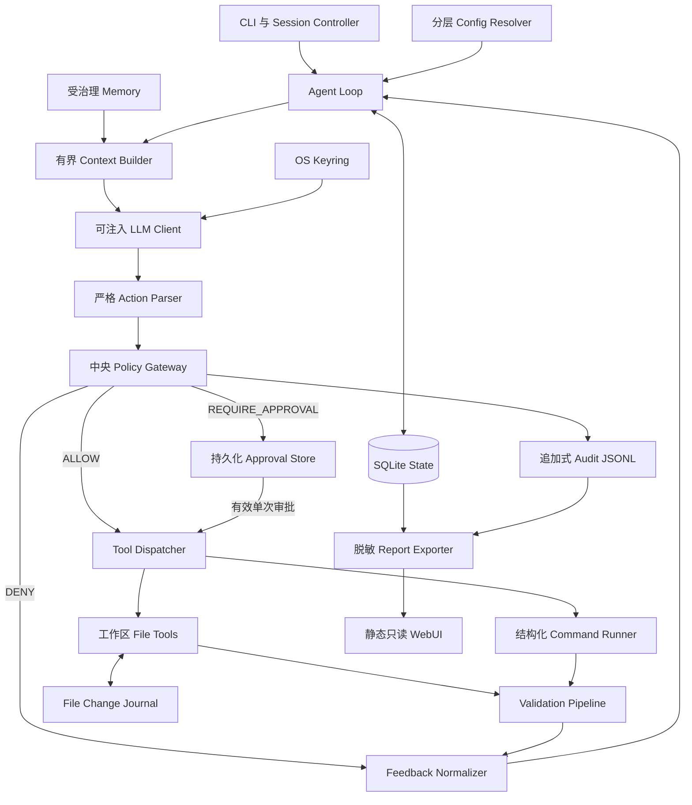

# Coding Agent Harness Jie - 项目规约

> 状态：Task 1-14 实现完成；Task 15 本地验收通过；远端 CI/Pages、PR 与最终 ZIP 交付验证进行中
>
> 负责人：Jie
>
> 日期：2026-08-11
>
> 本地验收日期：2026-08-14
>
> 开发方法：Superpowers、TDD、subagent 驱动开发

## 1. 问题陈述

大语言模型可以提出代码修改建议，但模型本身不能安全地操作本地代码仓库。它可能读取敏感文件、执行危险命令、重复失败动作、在没有验证证据时宣称完成，或者在失败后留下难以恢复的半成品状态。仅靠系统提示词中的“请注意安全”无法确定性地防止这些问题。

本项目实现一个面向个人开发者的 Python-first Coding Agent Harness。它的主要任务是修复导致 `pytest` 失败的 Python 代码；当项目存在客观验收命令时，也支持实现小功能；此外支持通过 `ruff`、`mypy` 等验证器完成仓库维护。

项目的主要贡献是**治理**：LLM 提出的每一个动作，都必须在产生副作用前经过确定性的代码策略。Harness 负责上下文、工具、安全、反馈、持久化、记忆、配置与完成判定；LLM 只负责提出下一步动作。

### 1.1 目标用户

- 本地 Python 仓库中存在失败测试的个人开发者。
- 希望获得 LLM 编码协助，但不愿开放任意终端和文件系统权限的用户。
- 需要检查 agent 行为为何被允许、暂停、拒绝或判定成功的评审者。

### 1.2 产品摘要

用户通过 CLI 指定本地工作区和任务。Harness 先建立验证基线，再组装有界上下文，通过 OpenAI-compatible 接口请求结构化工具动作。动作经过解析和中央策略网关后，只有被授权的操作才会执行；执行结果和确定性验证反馈进入下一轮。高风险动作暂停等待人工审批。失败或取消时，文件变更日志允许用户查看、保留或回滚修改。静态只读报告页展示经过脱敏的会话证据。

## 2. 目标与非目标

### 2.1 目标

1. 修复一个可稳定复现 `pytest` 失败的小型本地 Python 项目。
2. 在项目代码中自行实现完整 agent 主循环，不依赖高层 agent 框架。
3. 决策、工具、记忆、治理、反馈、配置六个维度均有可运行的最低实现。
4. 深入实现治理：风险分级、分层策略、持久化 HITL、动作指纹、单次审批、运行预算、工作区漂移检测、审计和可逆修改。
5. 使用 mock LLM 时，所有核心机制都能离线、确定性测试。
6. 真实 API Key 存入操作系统钥匙串，不通过正常命令、日志、报告、源码或 Git 暴露明文。
7. 交付可安装的 Python 包，以及安全的静态只读 mock 会话报告。

### 2.2 非目标

- 自动克隆任意远程仓库或执行 `git push`。
- 提供不受约束的 CMD、PowerShell、Bash 或原始 shell。
- 构建产品内多 agent、IDE 插件、插件市场或通用编排平台。
- 在第一版完整支持 JavaScript、Java 等多语言。
- 允许 WebUI 启动任务、审批动作、读取 OS Keyring、连接实时 SQLite 或执行工具。
- 每轮把完整仓库或全部会话历史发送给 LLM。
- 未经批准自动安装依赖。
- 防御已经控制当前操作系统账户的攻击者，或防御能够读取用户主动发送内容的恶意 LLM 供应商。

## 3. 用户故事

以下故事具有清晰边界和客观验收结果，整体符合 INVEST 原则。

### US-01 - 安全配置模型供应商

作为开发者，我希望配置 OpenAI-compatible 地址，并通过隐藏输入录入 API Key，从而使用真实模型而不把 Key 写进项目文件。

验收：`credentials set/status/update/clear` 可用；`status` 不显示明文；仓库与报告中不存在 Key。

### US-02 - 启动修复会话

作为开发者，我希望提供本地工作区和修复任务，并在 agent 修改前先得到失败验证基线。

验收：非法或不安全工作区被拒绝；有效工作区会创建持久化会话并记录基线。

### US-03 - 允许低风险自主操作

作为开发者，我希望普通读取、精确源码替换和已配置验证命令自动运行，从而避免每一步都需要审批。

验收：低风险结构化动作无需审批即可执行，并产生结构化 Observation。

### US-04 - 审批高风险动作

作为开发者，我希望新建/删除文件、修改依赖和 Git 写操作暂停等待审批，从而保留对重要副作用的控制。

验收：审批前动作不能执行；审批绑定会话和规范化动作；变更、过期、拒绝或已消费的审批均不能执行。

### US-05 - 阻断禁止动作

作为开发者，我希望工作区逃逸、敏感文件读取、shell 包装器、远程推送和状态篡改被拒绝，从而避免提示注入或项目配置绕过安全底线。

验收：策略单测返回 `DENY`；底层工具未被调用；审计记录脱敏后的原因。

### US-06 - 获得客观修复反馈

作为开发者，我希望代码修改后自动运行测试和质量检查，从而让 agent 根据客观失败而不是自我评价继续修复。

验收：第一次脚本化修改验证失败，反馈到达 mock LLM，下一动作发生改变并最终通过验证。

### US-07 - 暂停后恢复

作为开发者，我希望会话在等待审批、达到预算或进程退出时持久化，从而稍后检查并继续。

验收：重启 CLI 后恢复状态，重新验证工作区和审批指纹，仅在不变量成立时继续。

### US-08 - 保留或回滚修改

作为开发者，我希望失败或取消后查看本会话 diff，并选择保留或回滚，从而避免仓库被静默留在不希望的状态。

验收：回滚能恢复被修改/删除的文件、移除本会话新建文件，且不影响无关文件。

### US-09 - 复用受治理的项目知识

作为开发者，我希望后续会话复用已确认的项目约定、验证命令、决策和成功修复经验，而不是载入全部历史或信任未经验证的结论。

验收：只有验证成功或用户批准的结构化条目能激活；检索受项目范围和数量限制。

### US-10 - 查看安全会话报告

作为评审者，我希望通过静态报告查看动作、治理判定、审批、验证证据和结果，而不需要访问实时 Harness。

验收：页面只读取导出的 JSON，不包含可执行控制或敏感信息；公开示例只使用 mock 数据。

## 4. 领域与机制设计

### 4.1 六个 Harness 维度

| 维度 | 可运行的最低实现 | 第一版深度 |
|---|---|---|
| 决策 | 持久化主循环、结构化动作、停机条件、有界上下文 | 状态转换、协议重试、完成门禁、工作区漂移检测 |
| 工具 | 文件列举/读取/修改与结构化命令执行 | 原子精确替换、工作区围栏、输出与超时限制 |
| 记忆 | 跨会话结构化存储与检索 | 候选治理、证据、项目/类型/标签/关键词过滤 |
| 治理 | 所有副作用前的中央策略判定 | 主要贡献：分层策略、三级风险、持久化 HITL、单次审批、预算、审计和可逆修改 |
| 反馈 | 验证器生成可回灌的 Observation | 基线/快速/最终阶段、失败分类、脱敏和完成门禁 |
| 配置 | 内置、用户、项目、CLI 四层配置 | 低信任来源不能扩大高信任层权限 |

### 4.2 领域工具

模型只能申请已注册的结构化动作：

| 工具 | 输入 | 行为 | 输出 | 边界与错误 |
|---|---|---|---|---|
| `list_files` | 相对路径、glob、结果上限 | 列出工作区匹配文件 | 相对路径和截断标记 | 拒绝绝对路径和逃逸路径，不跟随逃逸链接 |
| `read_file` | 相对路径、行范围 | 有界读取 UTF-8 文本 | 带行号文本和截断标记 | 拒绝敏感文件，报告二进制/编码/大小错误 |
| `replace_in_file` | 路径、旧文本、新文本、期望匹配数 | 原子精确替换 | 修改范围和新指纹 | 匹配数不符时不写入；变更日志必须先持久化 |
| `create_file` | 路径、内容 | 原子创建文件 | 路径和指纹 | 需要审批；已有文件或不安全路径时失败 |
| `delete_file` | 路径 | 先备份再删除 | 路径和旧指纹 | 需要审批；备份失败则 fail-closed |
| `run_command` | 逻辑程序、参数列表、cwd、超时 | 在策略下以 `shell=False` 运行 | 退出码、脱敏/截断输出、耗时 | 拒绝未知程序和 shell；超时终止进程树 |
| `propose_memory` | 类型、内容、证据动作 ID、标签 | 创建受治理的记忆候选 | 候选 ID 和状态 | 类型/证据非法则拒绝，不自动激活未验证结论 |
| `finish` | 摘要 | 请求完成 | 最终验证结果或失败 Observation | 不能跳过强制验证器 |

### 4.3 客观反馈信号

- 第一次真实 LLM 调用前自动运行初始验证，建立基线。
- 每次文件修改后触发配置的快速验证阶段。
- `finish` 请求触发完整强制验证流水线。
- Python 默认验证器为 `pytest`，可增加 `ruff`、`mypy` 和其他命令。
- 失败类别包括 `test_failure`、`lint_failure`、`type_failure`、`timeout`、`tool_error`、`policy_blocked`、`approval_denied`。
- 结果包含验证器 ID、状态、退出码、耗时、摘要和脱敏/截断证据。
- 只有 Harness 的验证门禁能把会话设为 `SUCCEEDED`。

### 4.4 危险动作分类

默认 `ALLOW`：

- 列举/读取工作区普通文件。
- 精确替换普通源码。
- 运行 `python -m pytest`、`python -m ruff check`、`python -m mypy`、`python -m compileall`、`git status`、`git diff`。

默认 `REQUIRE_APPROVAL`：

- 新建或删除文件。
- 修改依赖、CI、构建或其他受保护配置。
- 使用 `python -m pip install --no-index` 安装工作区内或本地已有的包。
- 执行 `git add` 或 `git commit`。
- 提高会话资源预算。
- 批准长期记忆候选。

默认 `DENY`：

- 访问规范化工作区之外，或通过符号链接/junction 逃逸。
- 读写 `.env*`、私钥、证书、SSH 数据、OS Keyring、`.git` 内部、Harness 状态、审计或备份。
- 调用 CMD、PowerShell、Bash 等 shell 包装器、未知程序、管道、重定向、命令替换、远程推送或网络下载。
- 通过模型工具修改策略、审计或审批状态。
- 不带 `--no-index` 的 `pip install` 以及其他可能联网安装依赖的命令。

### 4.5 记忆需求

长期记忆只允许四类：`project_convention`、`validation_command`、`confirmed_decision`、`successful_fix`。状态为 `CANDIDATE`、`APPROVED`、`ACTIVE`、`REJECTED`、`DELETED`。只有确定性验证成功或用户明确批准后才能激活。检索按项目、类型、标签和关键词返回最多 5 条。第一版不使用向量数据库，也不把完整对话作为长期记忆。

## 5. 功能规约

### 5.1 CLI 与会话控制

Python 包暴露 `cah` 命令：

```text
cah run
cah sessions list|show|resume
cah approvals list|approve|deny
cah changes show|keep|rollback
cah credentials set|status|update|clear
cah memory list|approve|reject|delete
cah report export
cah demo governance
```

`cah run` 通过参数或交互提示获取工作区与任务。CLI 校验配置、规范化工作区、获取独占可写锁、创建会话和文件日志、运行基线验证，再进入主循环。同一工作区同时只能存在一个可写会话。

配置错误、启动被拒绝、暂停/错误状态或最终验证失败时，CLI 返回有文档说明的非零退出码。人类可读输出必须显示 session ID、停止原因和下一条有效命令。

### 5.2 Agent 主循环与 LLM 协议

项目代码自行实现：

```text
加载/创建会话
  -> 初始验证
  -> 组装有界上下文
  -> 调用 LLM
  -> 解析结构化动作
  -> 治理判定
  -> 执行、暂停或拒绝
  -> 规范化 Observation
  -> 自动验证修改
  -> 重复或停机
```

`LLMClient` 必须可注入。`ScriptedMockLLM` 返回确定性动作序列；`OpenAICompatibleClient` 只完成单次兼容的 chat completion/tool-calling 调用，并转换为相同内部 Action 联合类型。禁止使用供应商 agent runner 或高层 agent 框架。

第一版使用原生 tool calling。Pydantic 拒绝缺失字段、错误类型、未知工具和额外字段。允许一次协议纠正；连续第二次协议错误时持久化为 `PAUSED_PROTOCOL_ERROR`。

临时网络超时和 5xx 使用有界重试；认证错误和永久 4xx 不无限重试。错误持久化或显示前必须脱敏。

### 5.3 有界上下文

每轮包含任务、安全项目摘要、策略摘要、可用工具、验证器配置、最多 5 条相关 ACTIVE 记忆，以及最近动作/Observation。模型必须通过工具获取文件内容。文件和命令输出有行数/字节上限。完整历史保留在 SQLite，但不自动发送。

上下文超出预算时，按以下优先级保留：任务与完成标准、策略、当前失败、最近相关源码、近期 Observation、长期记忆、低优先级历史。

仓库文本属于不可信数据。源码中的“指令”不能修改工具注册、治理策略、配置优先级或完成门禁。

### 5.4 治理流水线

每个动作必须按不可绕过的顺序处理：

1. 规范化工具名、路径、程序、参数、cwd 和请求上限。
2. 应用硬性安全底线。
3. 合并用户策略、项目限制和会话预算。
4. 返回带稳定原因码的 `ALLOW`、`REQUIRE_APPROVAL` 或 `DENY`。
5. 在副作用前持久化策略判定和审计事件。
6. 仅在授权仍有效时交给 Dispatcher。

策略引擎只判定、不执行；Dispatcher 只执行已授权动作，不解释或放宽策略。

### 5.5 持久化审批

审批记录包含 session ID、action ID、规范化动作指纹、随机 nonce 摘要、状态、创建时间、过期时间、决定时间和消费时间。

```text
PROPOSED -> PENDING -> APPROVED -> CONSUMED
                    -> DENIED
                    -> EXPIRED
                    -> INVALIDATED
```

执行前重新规范化并计算指纹。会话不符、参数/路径变化、过期、工作区漂移、已消费或状态不符时均使审批无效。`DENY` 不能通过普通 CLI 转成审批。

CLI 可以在持久化 PENDING 后立即询问，也允许用户退出后再执行审批和恢复命令。危险操作默认答案为否，按 Enter 不代表同意。

### 5.6 预算与停机条件

默认上限：

- 20 个 agent 决策步骤。
- 12 次真实 LLM 调用。
- 连续 4 次验证失败。
- 同一规范化动作重复 2 次。
- 单条命令 120 秒。
- 单会话 30 分钟。
- 单动作最多向 LLM 回灌 50 KB 命令输出。

编译期硬上限：

- 40 个决策步骤。
- 24 次真实 LLM 调用。
- 连续 8 次验证失败。
- 同一动作最多重复 3 次。
- 单条命令 300 秒。
- 单会话 60 分钟。
- 单动作最多回灌 100 KB。

可信用户配置可在硬上限内调整默认值。项目配置只能降低。单次提高预算必须显式审批并被审计。达到限制后进入 `PAUSED_LIMIT_REACHED`，不能进入成功。用户可以检查状态、提高预算、保留或回滚。

### 5.7 变更日志与工作区漂移

第一次修改路径前，Harness 必须持久化旧状态，并把原始字节保存到目标仓库之外。新建、修改、删除分别记录。支持时使用同目录临时文件与原子替换。状态、审计或备份持久化失败时，不允许修改。

恢复时重新验证相关文件指纹。外部变化进入 `PAUSED_WORKSPACE_DRIFT` 并使待审批动作失效。回滚只处理本会话修改过的文件，不调用 `git reset`，不修改无关文件。

### 5.8 结构化记忆

LLM 可提出候选，但不能自行激活。成功验证可以为 `successful_fix` 或 `validation_command` 提供证据；主观决策和约定必须由用户批准。条目包含项目 ID、来源会话、证据引用、标签、时间和状态。用户可查看、批准、拒绝、删除。检索受范围和数量限制。

### 5.9 配置

配置格式为 TOML，使用严格模型：

1. 代码内置硬性安全底线。
2. 用户应用数据目录中的可信 `config.toml`。
3. 项目可选 `harness.toml`，只配置源码根、验证器和更严格限制。
4. CLI/会话参数，只能进一步收紧。

未知字段、类型错误、规则冲突、路径错误或权限扩张尝试全部 fail-closed。配置可保存供应商 URL、模型和凭据 profile，但不能保存明文 Key。

### 5.10 凭据

默认凭据后端为 Python `keyring` 与操作系统钥匙串。录入使用隐藏终端输入；`status` 只显示 profile/供应商是否存在及安全元数据。测试注入内存假实现。公开 mock 报告不需要 Key。子进程使用移除供应商凭据后的环境。

环境变量只能作为显式的临时覆盖来源，并在 README 中说明进程环境可见和明文风险。

### 5.11 持久化与审计

应用数据位于目标仓库之外：

```text
CodingAgentHarness/
  config.toml
  state.db
  audit/events.jsonl
  backups/<session-id>/
  reports/<session-id>.json
```

SQLite 是会话、动作、审批、Observation、验证、记忆和变更元数据的权威来源。多记录状态转换使用事务。原始文件字节保存在备份目录，并在平台支持时设置仅当前用户可访问。JSONL 审计在正常运行中只追加，按时间记录脱敏事件。

本项目不宣称能够防止本地操作系统账户所有者篡改状态或审计。

### 5.12 静态只读报告

`cah report export` 输出版本化 JSON，只包含安全会话元数据、相对路径、动作类型、策略判定、审批转换、验证摘要和最终状态。默认排除 API Key、环境变量、绝对路径、源码正文、备份内容、原始 prompt 和完整命令输出。

查看器使用 Open Design `web-prototype` skill 与 `Neutral Modern` design system，采用静态 HTML/CSS/JavaScript。它没有执行、审批、凭据、SQLite、文件系统或网络控制 API。所有不可信报告字段按文本渲染，不作为 HTML 执行。GitHub Pages 只托管 scripted mock 示例。

## 6. 会话状态模型

```text
CREATED -> RUNNING -> SUCCEEDED
             |  \
             |   -> PAUSED_APPROVAL -> RUNNING
             |   -> PAUSED_LIMIT_REACHED -> RUNNING
             |   -> PAUSED_PROTOCOL_ERROR
             |   -> PAUSED_WORKSPACE_DRIFT
             |   -> PAUSED_INTERNAL_ERROR
             -> NEEDS_USER_DECISION -> CHANGES_KEPT
                                    -> ROLLED_BACK
```

只有最终验证能产生 `SUCCEEDED`。所有暂停状态都必须持久化。取消和不可恢复错误保留证据并把保留/回滚选择交给用户。非法状态转换被拒绝并审计。

## 7. 系统架构



架构不变量：

1. LLM 不能绕过 Parser 和 Policy 直接调用工具。
2. 策略判定与工具执行使用分离接口。
3. 只有验证器能打开成功门禁。
4. WebUI 只接收脱敏导出文件，没有实时控制通道。

## 8. 数据模型

| 实体 | 主要字段 | 约束 |
|---|---|---|
| `Project` | ID、规范化路径、安全显示名 | 每个本地根只有一个规范化身份；公开报告不含绝对路径 |
| `Session` | ID、project ID、任务、状态、预算、时间 | 状态转换合法；每项目只有一个活动写会话 |
| `Action` | ID、会话/步骤、工具、规范化参数、指纹 | 提出后不可修改；敏感参数在审计/报告中脱敏 |
| `PolicyDecision` | action ID、结果、原因码、规则来源 | Dispatcher 前写入；结果只能是三级之一 |
| `Approval` | action/session、指纹、nonce 摘要、状态、过期/消费时间 | 单次使用、精确绑定、状态转换受约束 |
| `Observation` | action ID、类别、摘要、安全证据 | 发送模型、持久化或导出前均有界并脱敏 |
| `ValidationResult` | 验证器、阶段、状态、退出码、耗时、摘要 | 所有强制最终验证必须通过 |
| `MemoryEntry` | 项目、类型、内容、证据、标签、状态 | 只有 APPROVED/ACTIVE 且未删除条目可检索 |
| `ChangeRecord` | 会话、相对路径、操作、前后指纹、备份引用 | 原文件存在时，修改前必须已有备份 |
| `AuditEvent` | 序号、时间、会话/动作、事件类型、安全 payload | 正常运行只追加；不含 Key 或源码正文 |

## 9. 非功能需求

### 9.1 安全威胁模型

| 威胁 | 对策 |
|---|---|
| 仓库文本中的 prompt injection | 文件内容视为不可信数据，不能改变工具、策略、配置优先级或完成门禁 |
| 路径穿越/符号链接逃逸 | 每次副作用前规范化路径和父路径并验证工作区包含关系 |
| 命令注入 | 结构化 program/args、`shell=False`、逻辑程序白名单、拒绝 shell 包装器 |
| 敏感信息泄露 | 受保护文件规则、OS Keyring、子进程环境清理、上下文/日志/报告脱敏 |
| 恶意项目配置 | 严格 schema，项目层只能收紧，硬性安全底线不可关闭 |
| 审批重放或动作替换 | 会话/动作绑定、规范化指纹、nonce 摘要、过期、重新校验、单次消费 |
| 记忆污染 | 结构化候选、证据、验证或用户批准、可删除生命周期 |
| 暂停期间工作区变化 | 恢复时校验文件指纹，漂移时使审批失效并暂停 |
| 部分写入或无回滚证据 | 先持久化变更日志和备份，再执行原子修改 |
| 公共报告泄露/XSS | 最小脱敏导出、相对路径、文本渲染、静态页面、mock 公共数据 |
| 无限循环/费用失控 | 步骤、调用、失败、重复、时间和输出预算 |
| 恶意测试代码 | v1 只面向用户自己信任的本地仓库；允许的 `pytest` 仍以当前 OS 账户执行，不等同于 OS 沙箱 |

安全边界必须明确：`shell=False` 和工作区文件工具围栏可以约束 LLM 提出的命令与文件动作，但不能阻止被测试的 Python 代码主动访问网络或工作区外文件。第一版不承诺 Windows OS 级沙箱。用户首次在新仓库运行命令前必须看到此风险提示；公共演示永远使用 mock，不执行第三方代码。

### 9.2 性能

- 策略和配置判定必须确定性且不访问网络。
- 文件、命令输出和上下文均有限制，防止无界内存增长。
- 每轮最多注入 5 条长期记忆。
- 目标规模为小到中型课程仓库，不做全仓语义索引。
- 验证器耗时受命令和会话超时控制。

### 9.3 可用性

- 每次暂停/错误显示 session ID、原因和下一条有效命令。
- 危险审批默认否，并显示规范化动作和原因。
- 用户无需直接操作 SQLite 即可检查判定、变更、验证和记忆。
- CLI 在 Windows PowerShell 和常见终端中可用。

### 9.4 可观测性

- SQLite 提供当前状态查询。
- JSONL 提供按时间排序的机制证据。
- 日志包含 session/action 关联 ID，但不含 Key 和源码正文。
- 报告格式带 schema version，不兼容时查看器安全拒绝。

### 9.5 平台范围

主要开发和人工验收平台为 Windows x64 + Python 3.13。Linux CI 验证离线核心行为。OS Keyring 后端随平台变化；不支持钥匙串的无头环境只能使用 mock 或明确记录风险的临时凭据来源。第一版不宣称所有桌面平台完全一致。

## 10. 技术选型

| 选型 | 理由 |
|---|---|
| Python 3.13 | 用户指定，开发便捷，当前 base 环境可用 |
| Pydantic | 严格校验 Action、配置和数据模型 |
| Typer | 清晰子命令、交互提示和可测试 CLI |
| httpx | 低层 HTTP 调用，不引入 agent 框架 |
| keyring | 对接操作系统凭据存储 |
| sqlite3 | 标准库事务持久化，无外部数据库服务 |
| pytest | 主要客观反馈和本项目测试框架 |
| ruff、mypy | 确定性质量验证 |
| 原生 HTML/CSS/JS | 最小静态查看器，无 Web 后端控制面 |
| Open Design `web-prototype` + `Neutral Modern` | 适合开发者审计报告的信息层级 |
| GitHub Actions + Pages | 主 CI、包构建和公开 mock 报告 |

明确禁止使用 LangChain `AgentExecutor`、AutoGen、CrewAI、LlamaIndex agent、供应商 agent runner，或把宿主 coding agent 的 loop/hooks/memory 当作交付产物功能。允许使用底层 HTTP、解析、keyring 和测试库。

## 11. 测试策略

### 11.1 确定性单元测试

全部离线覆盖：

- 每种 Action schema，以及非法/未知动作。
- 路径穿越、绝对路径、敏感文件和可测试平台上的链接逃逸。
- 策略优先级与完整三级风险表。
- 审批过期、拒绝、动作替换、会话不符、单次消费和重放。
- 会话状态、全部预算、重复动作和完成门禁。
- 文件日志、原子替换、新建/删除、回滚和无关文件保护。
- 子进程白名单、`shell=False`、cwd、超时、输出限制、环境清理和脱敏。
- 基线/快速/最终验证与失败分类。
- 低信任配置不能扩大权限。
- 记忆候选、批准、检索和删除。
- 假凭据后端，保证不显示明文。
- 报告 schema、脱敏、相对路径和安全文本渲染。

### 11.2 集成测试

在临时目录创建带确定性失败测试的 Python 仓库。`ScriptedMockLLM` 先读取文件、做一次错误替换、接收注入的验证失败，再做正确替换并请求完成。只有最终验证通过后会话才能成功。测试不访问网络或真实 Keyring。

### 11.3 必做机制演示

`cah demo governance` 确定性展示：

1. 危险动作在 Dispatcher 前被拦截。
2. 注入验证失败后，mock LLM 改变下一步动作并最终通过。
3. 待审批动作跨重启保留，合法审批后只执行一次，重放被拒绝。

可选第四幕展示预算暂停和用户回滚。

### 11.4 真实供应商 Smoke Test

确定性测试通过后，可在本地使用真实 OpenAI-compatible 服务做人工 smoke test。它不进入 CI，且不得把供应商凭据写入捕获输出。

## 12. 分发与交付

- `pyproject.toml` 定义包、`cah` console script、依赖和构建元数据。
- GitHub Actions 含活动 job `unit-test`，每次 push 离线运行测试和质量检查。
- CI 构建 wheel 和 sdist；README 给出 `pipx`/`pip` 安装命令、目标平台和限制。
- 同时保留最小 `.gitlab-ci.yml` 的 `unit-test` job，以满足课程文档字面文件要求；实际 CI 以 GitHub 为准。
- GitHub Pages 只发布静态查看器和脱敏 mock 报告。
- README 说明安装、CLI、目录、安全边界、凭据、分发和已知限制。
- 最终用 `git archive` 从已跟踪内容生成 ZIP，排除 Git 元数据、缓存、本地状态、Key、备份和未跟踪文件。

## 13. 验收标准

| ID | 客观标准 |
|---|---|
| AC-01 | `cah run` 仅为合法规范化本地工作区创建持久会话，并记录基线 |
| AC-02 | scripted mock 在无网络、无真实 Key 时跑通完整自研主循环 |
| AC-03 | 每个模型动作在 Dispatcher 前均被解析并产生已记录策略判定 |
| AC-04 | 低风险读取、普通源码替换和验证可按策略自主运行 |
| AC-05 | 高风险动作暂停，缺少精确、有效、单次审批时不能执行 |
| AC-06 | 禁止动作被拒绝，底层工具调用次数为 0 |
| AC-07 | 注入验证失败后，mock 下一动作改变 |
| AC-08 | 所有强制最终验证未通过时不能进入 `SUCCEEDED` |
| AC-09 | 预算/重复/超时限制持久化暂停，并提供继续/保留/回滚 |
| AC-10 | 重启恢复待处理状态；工作区漂移使旧审批失效 |
| AC-11 | 回滚只恢复本会话修改，不使用破坏性 Git 命令 |
| AC-12 | 仅已验证/批准的结构化记忆可检索，每轮最多 5 条 |
| AC-13 | 项目/CLI 配置不能扩大用户或内置权限 |
| AC-14 | 凭据 set/status/update/clear 使用可注入后端且不显示明文 |
| AC-15 | 导出报告只含脱敏数据，公开查看器没有实时执行通道 |
| AC-16 | `cah demo governance` 稳定复现三项要求机制 |
| AC-17 | 一条等价命令离线运行核心测试，CI `unit-test` 通过 |
| AC-18 | 干净环境能安装构建包并运行 mock 机制演示 |

## 14. 风险与已知限制

| 风险 | 影响 | 对策/决定 |
|---|---|---|
| 只剩数日 | 可能无法完成全部外围功能 | 先完成中央循环和治理演示；真实适配器、报告美化和可选验证器后置 |
| Python 3.13 兼容性 | 某依赖可能不支持 | 锁版本前验证；优先替换非必要库，不改变核心架构 |
| OpenAI-compatible 差异 | 某供应商 tool calling 不一致 | v1 明确要求兼容原生 tool calling，不做自然语言猜测 |
| OS Keyring 后端差异 | Linux 无头环境可能不可用 | 真实模式面向桌面；CI/mock 注入假后端并说明限制 |
| 路径 TOCTOU | 检查后路径可能变化 | 副作用前立即复查规范化路径；承认无法完全防御恶意本地并发修改 |
| 测试代码以用户权限执行 | 恶意仓库仍可越界或联网 | v1 只接受用户信任仓库；启动提示；公开演示不运行第三方代码 |
| 验证器耗时 | 修复循环变慢 | 快速/最终阶段、命令超时和显式暂停 |
| 备份含私有源码 | 本地状态本身敏感 | 存在仓库外、设置用户权限、不导出不提交 |
| 静态页面被误解为控制 UI | 评审期待在线操作 | README 和页面明确标为只读，CLI 是唯一控制面 |

当前不存在阻塞 PLAN 的未决产品范围问题。实现细节只有在保持上述行为契约的前提下才能调整，并按类型记录到 `SPEC_PROCESS.md`、`PLAN.md` 和 `AGENT_LOG.md`。

## 15. 工作流门禁

正式实现的默认门禁如下：

1. 用户审阅并批准本 SPEC。
2. 使用 Superpowers `writing-plans` 生成包含失败测试和验证命令的 `PLAN.md`。
3. 一个不同类型的新鲜智能体仅获得 `SPEC.md` 和 `PLAN.md`，尝试 1-2 个任务并暴露歧义。
4. 冷启动发现写入 `SPEC_PROCESS.md`，所需 SPEC/PLAN 修订获得批准。

2026-08-12，项目在时间盒与资源约束下调整第 3、4 项：使用一个不继承当前对话历史和 memory 的 fresh Codex 子智能体，只读审查 `SPEC.md` 与 `PLAN.md` 中 Task 1-2 的可执行性。该审查不是 Claude Code 实现试运行，也不声称与课程要求的异构智能体实验等价；其真实发现和修订记录在 `SPEC_PROCESS.md` 与 `AGENT_LOG.md`。相关阻塞已修订，第 1、2 项已完成，替代审查也已形成可核验证据，因此实现门禁打开。
